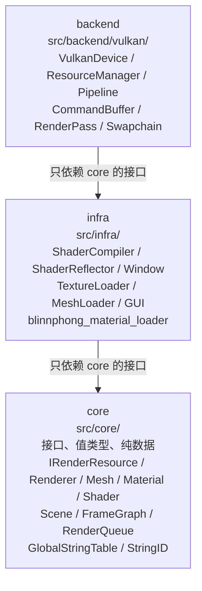
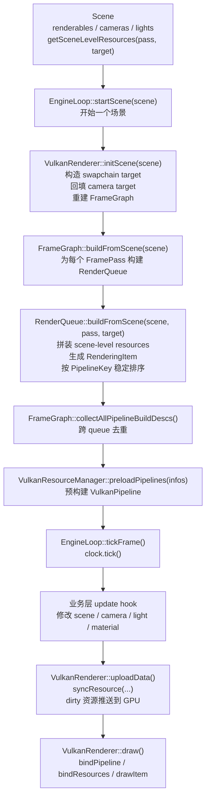

# 架构总览

这份文档回答三个最核心的问题：

1. 代码为什么要分成 `core / infra / backend` 三层。
2. 一份场景数据如何一步步变成 GPU 上真正执行的 draw call。
3. 资源、材质、shader、pipeline 这些对象分别在哪一层定义、在哪一层落地。

如果只想先建立整体心智模型，可以先记住下面这句话：

> `core` 负责定义抽象和数据形状，`infra` 负责把抽象接到工程级实现，`backend` 负责把这些抽象真正翻译成 Vulkan 命令。

再进一步看，这套架构的目标并不是“把代码分目录”这么简单，而是同时满足三件事：

- **隔离平台与图形 API**：业务层和场景层不直接依赖 Vulkan 细节。
- **统一资源同步路径**：所有 GPU 资源都走 `IRenderResource + dirty` 这一条上行链路。
- **统一绘制数据流**：所有可绘制对象都必须经过 `Scene -> FrameGraph -> RenderQueue -> RenderingItem`，backend 不允许私接旁路。

因此，阅读本文件时可以把它当成一张“渲染引擎总地图”：先看层次，再看资源生命周期，最后看一帧数据怎么流过去。

## 三层结构

图中的术语说明：

- `core`：引擎的“抽象层”。这里放接口、值类型、资源描述、场景数据结构，以及不依赖具体平台和图形 API 的纯逻辑。
- `infra`：引擎的“工程实现层”。这里不是随意堆工具，而是把 `core` 里的抽象接到具体库，例如 shader 编译、窗口系统、纹理加载、mesh 导入、GUI。
- `backend`：引擎的“图形后端层”。这里是 Vulkan 的真实落地点，负责设备、资源上传、pipeline 构建、命令录制和提交。
- 图里的箭头表示**允许的依赖方向**，不是运行时调用方向。意思是上层代码在编译期能 include 哪一层。

这张图最重要的不是“三层”本身，而是**层与层之间的约束**：

- `core` 必须保持最稳定、最少依赖，因此不能 include `infra/` 或 `backend/`
- `infra` 可以使用 `core` 的接口，但不能直接碰 `backend`
- `backend/vulkan` 负责最终落地，因此可以消费 `core` 与 `infra` 提供的结果

这样做的结果是：

- 场景系统、材质系统、FrameGraph 等核心逻辑不被 Vulkan API 污染
- shader 编译、窗口、资源导入等“工程能力”可以替换实现，而不会撕裂核心接口
- backend 可以专注做“翻译”和“执行”，而不是重新定义引擎数据模型

**依赖规则**（详见 `openspec/specs/cpp-style-guide/spec.md`）：

- `core/` **不允许** include `infra/` 或 `backend/`
- `infra/` 可以 include `core/`，不可 include `backend/`
- `backend/vulkan/` 可以 include 两者

命名空间：

- Core: `LX_core`
- Infra: `LX_infra`
- Backend: `LX_core::backend`（**嵌套在 core 下**，不是独立的顶层 `LX_backend`）

一个更实用的理解方式是：

- 你在 `core` 里描述“资源是什么”“场景怎么组织”“一次 draw 需要哪些输入”
- 你在 `infra` 里解决“shader 怎么编译”“模型怎么读进来”“窗口怎么创建”
- 你在 `backend` 里解决“这些抽象最终对应哪些 Vulkan 对象和命令”

## 资源生命周期模型

渲染引擎里最容易失控的部分之一，是“CPU 改了数据，GPU 什么时候看到”。本项目把这件事收敛成一个统一模型：**所有 GPU 端可消费资源都继承 `IRenderResource`，所有上传都通过 dirty 通道驱动**。

核心抽象在 `src/core/rhi/render_resource.hpp:44` 的 `class IRenderResource`。它不是“某一种资源”，而是所有 GPU 可消费对象的共同基类。典型例子包括：

- `SkeletonUBO` (`src/core/asset/skeleton.hpp:24`)：骨骼矩阵数组
- `UboByteBufferResource` (`src/core/asset/material.hpp:247`)：material 的 std140 字节 buffer 包装器
- `CombinedTextureSampler` (`src/core/asset/texture.hpp:49`)：纹理 + sampler 对
- `IVertexBuffer` / `IndexBuffer` (`src/core/rhi/vertex_buffer.hpp:151` / `index_buffer.hpp:50`)
- `CameraUBO` / `DirectionalLightUBO` / `ObjectPC`：场景与绘制路径会消费的 GPU 数据

这里要特别注意：项目把“可被 backend 同步和绑定的东西”抽象成 `IRenderResource`，因此 backend 不需要知道上层对象的业务语义，只需要根据 `ResourceType`、字节内容、binding 信息去处理。

### Dirty 模型

GPU 同步通过“dirty 标志 + ResourceManager 同步”完成：

1. CPU 代码修改资源内容，然后调用 `setDirty()`
2. `VulkanResourceManager::syncResource(cmdBufferMgr, resource)` 在每帧检查 dirty 位
3. 如果命中 dirty，就把 CPU 数据拷贝到 staging buffer，并录制/提交 copy command
4. 上传完成后调用 `clearDirty()`

这条链路的重要性在于：它把“什么时候上传 GPU”从业务代码里抽离出来，统一放在 backend 的资源同步阶段处理。业务层只需要负责表达“我变了”，不负责决定“我怎么传”。

可以把它理解成两段职责分离：

- `core` 资源对象负责保存 CPU 侧真值，并通过 dirty 位声明“数据已过期”
- `backend` 资源管理器负责观察这个声明，并在合适的帧阶段把数据推到 GPU

这也是为什么本文前面说：**这条路径是 GPU 同步的唯一触发点**。任何新资源如果希望被 backend 正确管理，就必须：

- 继承 `IRenderResource`
- 在数据变更时设置 dirty
- 让 backend 能从统一接口读取字节内容和资源类型

如果绕过这条路径，代价通常是：

- 上传时机分散在各处，难以定位同步 bug
- backend 需要写特殊分支处理某个资源
- 同一类资源无法共享一致的生命周期约束

## 场景启动与每帧工作流

> 这一节只回答 `EngineLoop` 在全局渲染路径里的位置，不展开它的设计动机、接口取舍和使用建议。那部分请先看 [`引擎循环`](引擎循环.md)，实现细节看 [`subsystems/engine-loop.md`](subsystems/engine-loop.md)。

三层结构解释的是“代码怎么组织”，资源生命周期解释的是“数据怎么上 GPU”，而真正的运行时工作流还要再分成两段：

- **场景启动阶段**：把 `Scene` 整理成 `FrameGraph / RenderQueue / RenderingItem`，并预构建 pipelines
- **每帧执行阶段**：让业务层修改 CPU 侧真值，然后上传 dirty 资源并执行 draw

`VulkanRenderer::Impl` 持有一个 `FrameGraph m_frameGraph` 成员，生命周期和 scene 绑定。数据流仍然是**单向**的：`Scene -> FrameGraph -> 每个 FramePass 的 RenderQueue -> 每个 RenderingItem -> backend 绘制`。但 `buildFromScene` / `preloadPipelines` 属于**场景启动阶段**，不是每帧重复做的常规工作。

图中的术语说明：

- `Scene`：CPU 侧场景真值，里面有 renderables、cameras、lights 等对象，还能按 `pass + target` 提供 scene-level 资源。
- `EngineLoop::startScene(scene)`：引擎级“开始一个场景”的入口。它是应用层接触到的场景生命周期边界。
- `initScene(scene)`：renderer 接管一个新场景时的初始化入口。这里会确定 render target、把 camera 和 target 对应起来，并重建 `FrameGraph`。
- `FrameGraph`：一帧的渲染结构描述。它决定这一帧有哪些 `FramePass`，每个 pass 画到哪里。
- `FramePass`：`FrameGraph` 里的一个 pass 节点，例如 forward、shadow、deferred。一个 pass 对应一个 `RenderTarget` 和一个 `RenderQueue`。
- `RenderQueue`：单个 pass 内部的 draw call 队列。它负责把 scene 中满足条件的对象筛出来，变成 backend 能消费的 `RenderingItem`。
- `RenderingItem`：一次 draw 的完整上下文，包括顶点/索引 buffer、材质、shader、descriptor 资源、所属 pass、pipeline 身份等。
- `PipelineBuildDesc`：构建图形 pipeline 所需的完整描述。它是从 `RenderingItem` 推导出来的 backend-agnostic 值对象。
- `PipelineKey`：pipeline 的结构化身份。相同 key 的 item 应该复用同一条 pipeline。

把这张图按时间顺序读，可以分成两段。

### 开始渲染一个场景时

1. `Scene` 持有 CPU 侧全部渲染输入。
2. `EngineLoop::startScene(scene)` 把场景生命周期切换到一个新的 scene。
3. `initScene` 根据 scene 和 target 重新建立 `FrameGraph`。
4. `FrameGraph::buildFromScene` 为每个 pass 构建 `RenderQueue`。
5. `RenderQueue::buildFromScene` 把场景对象整理成 `RenderingItem`，并按 `PipelineKey` 稳定排序。
6. `FrameGraph::collectAllPipelineBuildDescs` 跨 queue 收集并去重 pipeline 描述，交给 backend 预构建。

### 每帧循环时

1. `EngineLoop::tickFrame()` 推进时钟。
2. 业务层 update hook 修改 scene / camera / material / light 等 CPU 侧真值。
3. 每帧 `uploadData()` 先同步 dirty 资源。
4. `draw()` 再绑定 pipeline、资源并发出绘制命令。

这条路径有两个架构意义：

- **它是唯一合法的绘制入口**。backend 不应该自己偷偷拼装 draw item。
- **它把“组织绘制数据”和“执行绘制命令”分开了**。前者属于 scene/framegraph 的场景启动阶段，后者属于 backend/vulkan 的每帧执行阶段。

其中 pipeline 身份的构造可以写成：

\[
\mathrm{PipelineKey}
=
\mathrm{build}\bigl(
\mathrm{ObjectSignature}(pass),
\mathrm{MaterialSignature}(pass)
\bigr)
\]

意思是：pipeline 的身份来自“这个对象在当前 pass 下的渲染形状”与“这个材质在当前 pass 下的渲染形状”的组合。只要这两个签名没有变，理论上就应该命中同一条 pipeline。

而跨 pass 收集 pipeline 描述的去重过程，本质上是在做：

\[
\mathrm{UniqueBuildDescs}
=
\bigcup_{p \in \mathrm{FramePasses}} \mathrm{Collect}(p.\mathrm{queue})
\]

意思是：先分别从每个 pass 的 queue 收集构建描述，再做并集去重，最终交给 backend 预热 pipeline cache。

> REQ-009 备注：`Scene` 已不再持有单一 `camera` / `directionalLight` 字段，而是用 `m_cameras` / `m_lights` 两个 vector。相机的 target 轴和光源的 pass 轴是正交过滤维度，由 `getSceneLevelResources(pass, target)` 在 `RenderQueue::buildFromScene` 中合并消费。

## 核心接口层（`src/core/rhi/`）

上面几节解释了“整体怎么运转”，这里再落到最底层的核心接口。`src/core/rhi/` 是 renderer 抽象的地基，它定义 backend 必须理解、但又不暴露 Vulkan 细节的一组核心类型。

| 文件 | 内容 |
|------|------|
| `render_resource.hpp` | `IRenderResource` 基类、`ResourceType` / `ResourcePassFlag` 枚举、`PC_Base` / `PC_Draw` push constant 类型 |
| `renderer.hpp` | `Renderer` 抽象基类（被 `VulkanRenderer` 实现） |
| `image_format.hpp` | `ImageFormat` 枚举（`RGBA8` / `BGRA8` / `R8` / `D32Float` / `D24UnormS8` / `D32FloatS8`），backend 做 native 格式映射 |
| `render_target.hpp` | `RenderTarget` 结构（colorFormat + depthFormat + sampleCount），目前不参与 `PipelineKey` |

这几个类型的共同特点是：它们都在描述“渲染系统需要哪些事实”，而不是“Vulkan 里该怎么写”。例如：

- `ImageFormat` 只描述引擎语义上的格式，不直接暴露 `VkFormat`
- `RenderTarget` 只描述目标附件集合，不直接暴露 `VkRenderPass` 或 `VkFramebuffer`
- `Renderer` 只定义 renderer 应该提供的能力，而不暴露具体命令录制细节

因此，`core/rhi` 的作用可以概括成一句话：**把 backend 需要理解的最小共识抽出来，但不把 backend 的实现细节反渗透回上层**。

## Infra 层的职责

很多项目里 `infra` 会慢慢退化成“杂物间”，但这里不是。这个项目里的 `infra` 有一个非常明确的边界：**它是 `core` 抽象的工程级实现层**。

可以用下面这张对应表来理解：

| Core 接口 | Infra 实现 | 位置 |
|-----------|-----------|------|
| `IShader` | `CompiledShader`（通过 `ShaderCompiler` + `ShaderReflector` 产生） | `src/infra/shader_compiler/` |
| `LX_core::Window` | `LX_infra::Window`（SDL3 或 GLFW） | `src/infra/window/` |
| Material factory | `loadBlinnPhongMaterial()` | `src/infra/material_loader/blinn_phong_material_loader.hpp` |
| Mesh IO | `ObjLoader` / `GLTFLoader` | `src/infra/mesh_loader/` |
| Texture IO | `TextureLoader`（stb_image） | `src/infra/texture_loader/` |
| GUI | `Gui`（imgui） | `src/infra/gui/` |

图示外再补一层理解：

- `core` 说“shader 对外应该长什么样”，`infra` 负责“把 GLSL 编译和反射变成这个样子”
- `core` 说“窗口系统应该提供哪些抽象能力”，`infra` 负责“用 SDL3 或 GLFW 把它做出来”
- `core` 说“材质、mesh、texture 是什么资源”，`infra` 负责“把磁盘文件变成这些资源”

所以，`infra` 的存在价值不是减少代码量，而是把“项目依赖哪些第三方库、怎样接库”这类变化较快的实现细节，与 `core` 里的稳定抽象隔开。

core 与 infra 之间通过**构造函数注入**连接，禁止 setter DI（见 cpp-style-guide spec R5）。这意味着依赖关系必须在对象构造时就明确，而不是在运行过程中四处补线。这样做的直接好处是：

- 所有权更清晰
- 生命周期更可推导
- 测试更容易替换依赖
- 不会出现“对象先半初始化，后续再补依赖”的脆弱状态

## 读图后的整体结论

如果把整套架构压缩成最少的几条规则，可以总结为：

- **分层规则**：`core` 定义抽象，`infra` 连接工程实现，`backend` 执行 Vulkan 落地。
- **资源规则**：所有 GPU 资源必须走 `IRenderResource + dirty + syncResource()`。
- **绘制规则**：所有 draw 必须走 `Scene -> FrameGraph -> RenderQueue -> RenderingItem`。
- **身份规则**：pipeline 不是临时状态，而是由对象签名和材质签名组合出来的结构化身份。

理解这四条以后，再去看具体模块时就会容易很多，因为你能先判断一段代码“属于哪一层、解决哪一类问题、应该遵守哪条主链路”，而不是直接陷进实现细节里。

## 延伸阅读

- `openspec/specs/cpp-style-guide/spec.md`：所有权、智能指针、RAII 强制规则
- `openspec/specs/renderer-backend-vulkan/spec.md`：`VulkanDevice` / `Buffer` / `Texture` / `Shader` / `Pipeline` 的详细契约
- `notes/subsystems/shader-system.md`：shader 编译、反射与 `CompiledShader`
- `notes/subsystems/material-system.md`：材质模板、材质实例与 UBO 写入
- `notes/subsystems/string-interning.md`：字符串驻留与结构化 compose
- `GUIDES.md`：开发流程与命令链
