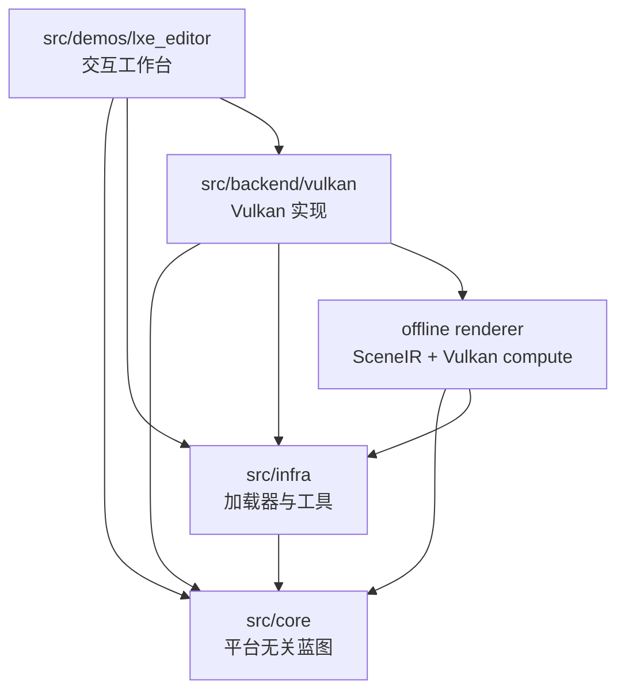
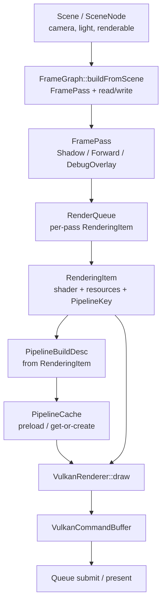
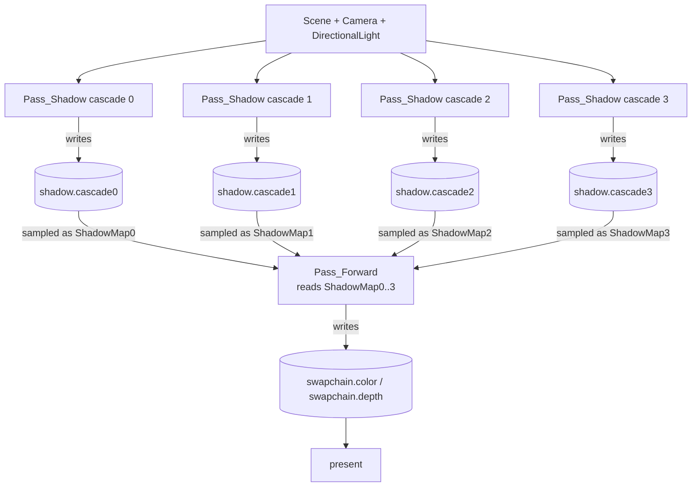
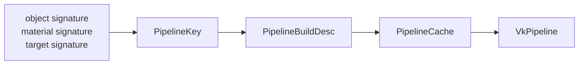
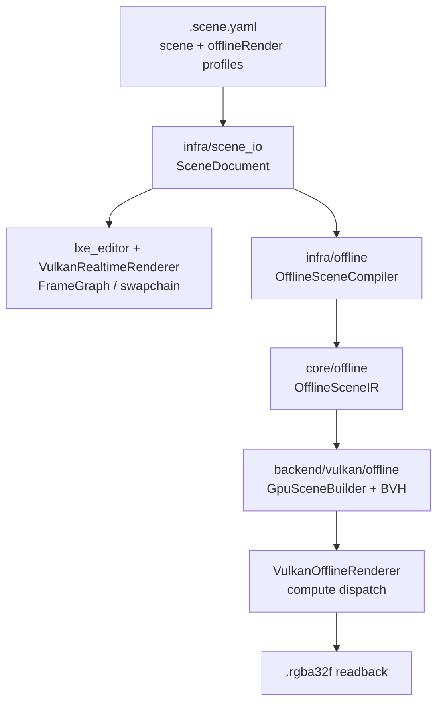

# 架构总览：三层工厂和一条多 Pass 生产线

LXEngine 的架构可以先想成一座工厂：`core` 画产品蓝图，`infra` 负责把外部材料和工具接进来，`backend` 负责把蓝图真正送上 Vulkan 生产线。v0.1.1 之后，这条生产线不只做一次 forward draw，还会先生产 shadow cascade depth，再把这些临时资源接回 forward pass。

## 三层结构先把责任隔开

| 层 | 类比 | 当前目录 | 主要职责 |
|---|---|---|---|
| `core` | 蓝图室 | `src/core/` | 平台无关的 scene、material、frame graph、pipeline identity、RHI 接口 |
| `infra` | 工具间 | `src/infra/` | shader 编译反射、mesh/texture/material loader、window、ImGui 接入 |
| `backend` | Vulkan 车间 | `src/backend/vulkan/` | device、resource upload、attachment、descriptor、pipeline、command buffer、present |
| `offline` | 离线实验室 | `src/core/offline/`, `src/infra/offline/`, `src/backend/vulkan/offline/` | scene profile、OfflineSceneIR、headless compute renderer、readback |
| `editor` | 集成工作台 | `src/demos/lxe_editor/` | project/scene runtime、UI、CommandBus、API/recording |

这张图最重要的事实是：`core` 不反向依赖 `infra` 或 `backend`。Scene、FrameGraph、PipelineKey 都必须能在不知道 Vulkan 的情况下表达清楚。

## 一帧渲染从 Scene 走到 GPU submit

运行时渲染像一条生产线：Scene 提供原料，FrameGraph 排工序，RenderQueue 把每道工序要画的对象装箱，Pipeline 系统准备机器配置，Vulkan backend 执行命令。

`Scene::getSceneLevelResources(pass, target)` 会在 queue 构建阶段把 camera/light 这类系统资源合进 `RenderingItem`。Backend 按 shader 反射出来的 binding name 做 descriptor 路由，draw 所需资源都随 `RenderingItem` 进入命令录制。

## Shadow-era 的资源流是先写再读

CSM 像把相机视野切成四段，每段先从灯光方向拍一张 depth 底片。Forward pass 再按当前像素深度选择对应底片采样。

`FrameGraphRead::sampled(resource, bindingName)` 同时保存 FrameGraph resource 名和 shader binding 名。Vulkan command buffer 录制 descriptor 时，再从当前 frame 的 attachment registry 解析出实际 image view。

## Pipeline identity 只看结构差异

Pipeline 像一套已经调好的机器配置。它应该被 shader、render state、vertex input、target 这类结构差异影响，而不是被材质颜色、transform 或 light intensity 这类普通数据影响。

Shadow depth target 和 swapchain forward target 不是同一种 render target signature，因此它们不会错误共享同一个 pipeline。

## 模块归属表

| 系统 | 主要目录 | 当前职责 | 不负责什么 |
|---|---|---|---|
| Scene | `src/core/scene/` | runtime object graph、camera/light/renderable、scene-level resource 筛选 | Vulkan submit、shader 编译 |
| Asset / Material | `src/core/asset/`, `src/infra/material_loader/` | `.material` 到 `MaterialTemplate` / `MaterialInstance`、pass、binding ownership、runtime 参数 | FrameGraph resource 生命周期 |
| FrameGraph | `src/core/frame_graph/` | pass 顺序、target desc、read/write 声明、queue 构建、compile 校验 | attachment 分配、自动 pass reorder、aliasing |
| RenderQueue | `src/core/frame_graph/` | per-pass renderable 过滤、scene-level resource 拼接、pipeline build desc 去重 | pass 间依赖推导、材质首次校验 |
| Pipeline | `src/core/pipeline/`, `src/backend/vulkan/details/pipelines/` | backend-agnostic build desc、target-aware pipeline identity、Vulkan pipeline materialization | 材质参数值更新 |
| Vulkan backend | `src/backend/vulkan/` | attachment、render pass/framebuffer、descriptor by name、command buffer、submit/present | scene authoring、业务 update |
| Editor | `src/demos/lxe_editor/` | project/scene runtime、ImGui UI、CommandBus、API/recording 集成 | 新渲染层、engine-level MCP |
| Notes / Requirements | `notes/`, `openspec/specs/` | 当前能力解释、future/pending 标注、文档导航 | 单独证明实现，最终仍以 `src/` 和 specs 为准 |

## Realtime 与 Offline 是两条渲染入口

实时视口像工作台上的即时预览；离线渲染像旁边的实验仪器。它们读取同一份 scene/asset 事实，但执行目标不同：realtime 追求交互帧率和 swapchain present，offline 追求可复现实验、ground truth 对比和 path tracing 迭代。

当前 offline MVP 的命令入口是 `src/tools/lxe_offline_render/lxe_offline_render`。它不依赖 editor UI，只复用 scene 文档、路径解析、core math/offline IR 和 Vulkan 基础设施。

## 当前能力和 pending 边界

| 领域 | 当前事实 | Pending 边界 |
|---|---|---|
| FrameGraph | 显式 pass 顺序、read/write 声明、compile 校验、per-pass queue | task-based build、自动重排、aliasing |
| Shadow / CSM | 4 个 directional shadow cascade，forward 读取 `ShadowMap0..3` | shadow debug visualization 仍可继续扩展 |
| Forward output | forward HDR scene color、post process、bloom 和 swapchain 输出链路 | 更完整的 post stack 和调试 dump 仍可扩展 |
| Material / lighting | Blinn-Phong、shadow pass、PBR + scene-level IBL 资源合同、金属球验证场景 | 更完整的 PBR texture set 和 local probe |
| Offline renderer | scene profile、OfflineSceneIR、Vulkan compute primary-ray MVP、`.rgba32f` readback | EXR/PNG、真实 HDR environment sampling、多 bounce path tracing |
| Deferred | 存在 `Pass_Deferred` 常量和方向 | G-Buffer / Deferred renderer 还未实现 |
| Editor integration | ImGui editor、CommandBus、API/recording | Web Editor、engine-level CLI/MCP、AssetRegistry/hot reload 仍在 pending |

## 继续阅读

- [项目目录结构](project-layout.md)
- [渲染管线](rendering-pipeline/index.md)
- [Shadow 阶段教程](../tutorial/shadow-era/index.md)
- [Offline Renderer 教程](../tutorial/offline-renderer/index.md)
- [Vulkan Backend](../subsystems/vulkan-backend.md)
