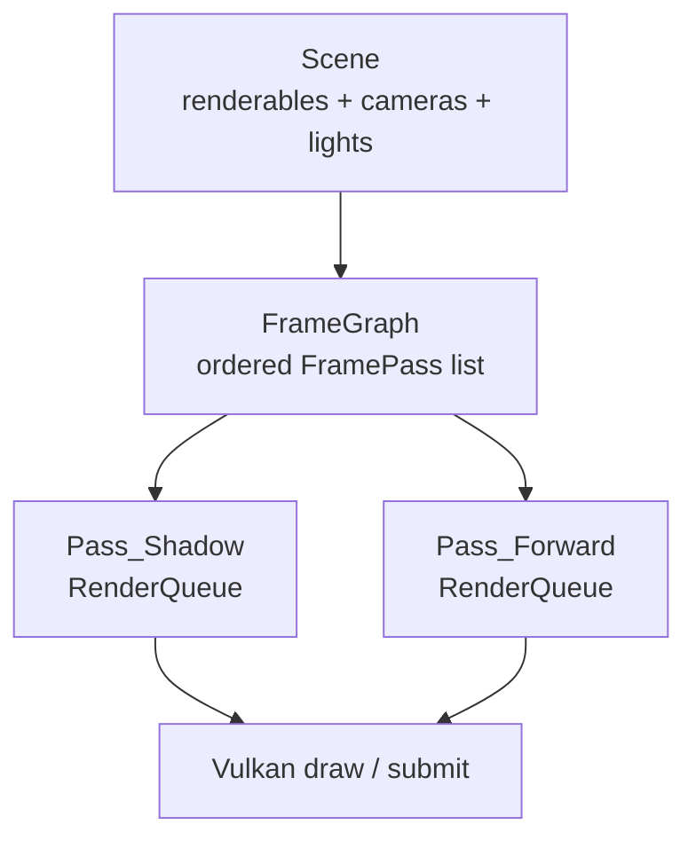
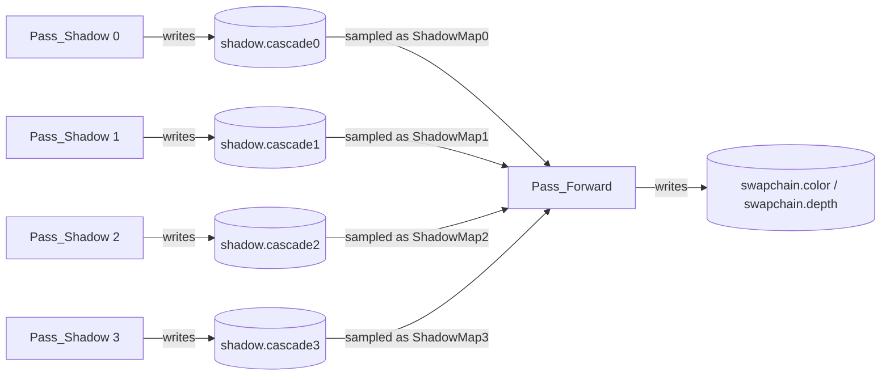
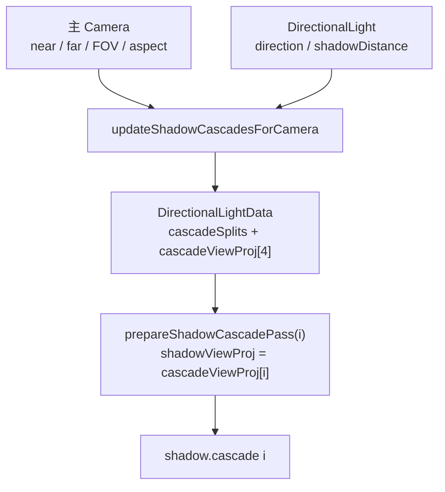

# FrameGraph、Render Target 与 Shadow：一帧怎样被拆成多道工序

FrameGraph 可以先想成工厂里的工序排程表：每道工序有名字、工位和输入输出。Render Target 是工位上能放什么托盘，Shadow Pass 是先生产深度底片的工序，CSM 则是把这张底片拆成四段，让近处和远处都能用合适的精度。

这篇文档只讲当前 v0.1.1 已经落地的路径：4 个 directional shadow cascade 先写 depth，Forward pass 再读取这些 depth resource 并写入 swapchain。HDR/Post、G-Buffer/Deferred、task-based pass build 仍是后续方向，不是当前事实。

## 一帧不是一个 draw，而是一组有顺序的 pass

在当前引擎里，一个材质可以同时定义 `Forward` 和 `Shadow` pass。同一个 mesh 会被拆成不同 pass 视角下的 `RenderingItem`，然后分别进入对应的 `RenderQueue`。

| 工厂类比 | 当前对象 | 作用 |
|---|---|---|
| 工序排程表 | `FrameGraph` | 保存一帧有哪些 `FramePass`，并按声明顺序执行 |
| 单道工序 | `FramePass` | 绑定 pass name、target、reads、writes 和 queue |
| 工位托盘规格 | `RenderTargetDesc` | 描述输出 attachment 的形状，不持有 backend 资源 |
| 半成品名字 | `FrameGraphResourceRef` | 用稳定 `StringID` 表达 pass 之间的资源流 |
| 工序内任务箱 | `RenderQueue` | 保存某个 pass 下可以直接提交的 `RenderingItem` |

当前 `FrameGraph` 的核心约束很明确：pass 声明顺序就是执行顺序。它会校验“读到的资源必须由更早的 pass 写出”，但不会自动重排 pass，也不会做 attachment aliasing。



## Render Target 描述工位，不拥有 Vulkan 对象

Render Target 容易和 Vulkan image 混在一起理解。当前代码刻意把它们拆开：`RenderTargetDesc` 只描述“这道 pass 要写什么形状的 attachment”，真正的 image、view、framebuffer 由 Vulkan backend 在执行时绑定。

| 对象 | 当前层级 | 保存什么 | 不保存什么 |
|---|---|---|---|
| `RenderTargetDesc` | `src/core/frame_graph/` | role、color/depth format、sample count、layer count | Vulkan image / image view / framebuffer |
| `RenderTarget` | `src/core/frame_graph/` | 与 camera target matching 兼容的 target 值 | pass 之间的 resource 依赖 |
| FrameGraph attachment | `src/backend/vulkan/` | 当前 frame 的实际 image、view、layout、framebuffer | scene 语义 |

例如 shadow pass 使用 depth-only offscreen target：

```cpp
const auto shadowTarget =
    LX_core::RenderTargetDesc::offscreenDepth(swapchainTarget.depthFormat);
```

这句话只说明“这道工序需要一个离屏 depth 托盘”。托盘什么时候创建、当前 frame 用哪一个 Vulkan image、写完后如何 transition 到 shader-read layout，都是 backend 执行层的职责。

## pass 之间靠 resource name 传递半成品

FrameGraph resource name 像半成品标签。Shadow pass 写 `shadow.cascade0`，Forward pass 读同一个名字，并把它接到 shader binding `ShadowMap0`。

| Resource name | 写入者 | 读取者 | Shader binding |
|---|---|---|---|
| `shadow.cascade0` | Shadow cascade 0 | Forward | `ShadowMap0` |
| `shadow.cascade1` | Shadow cascade 1 | Forward | `ShadowMap1` |
| `shadow.cascade2` | Shadow cascade 2 | Forward | `ShadowMap2` |
| `shadow.cascade3` | Shadow cascade 3 | Forward | `ShadowMap3` |
| `swapchain.color` | Forward | present | swapchain image |
| `swapchain.depth` | Forward | depth test | swapchain depth |



`FrameGraphRead::sampled(resource, bindingName)` 保存的是“读哪个半成品”和“接到哪个 shader 插口”。Vulkan command buffer 录制 descriptor 时，才把 `shadow.cascade*` 解析成当前 frame 的实际 attachment image view。

## Shadow Pass 只生产深度底片

Shadow Pass 像从灯光方向拍一张黑白深度底片。它不需要输出颜色，只需要记录“从光源看过去，哪个表面更近”。

当前内置 Blinn-Phong lit 材质这样声明 pass：

```yaml
passes:
  Forward:                         # -> MaterialTemplate 的 Forward pass
    renderState:
      cullMode: Back
      depthTest: true
      depthWrite: true
  Shadow:                          # -> MaterialTemplate 的 Shadow pass
    shader: shadow_depth_only       # -> depth-only shader family
    renderState:
      cullMode: Front
      depthTest: true
      depthWrite: true
```

`shadow_depth_only.vert` 使用 `LightUBO.shadowViewProj` 把 mesh 顶点变换到 light clip space；fragment shader 可以保持最小，因为这个 pass 的输出是 depth attachment。

| 阶段 | 当前输入 | 当前输出 |
|---|---|---|
| Shadow vertex shader | model matrix、`LightUBO.shadowViewProj`、mesh position | light clip space position |
| Shadow fragment shader | 无颜色需求 | depth attachment |
| Vulkan pass | `Pass_Shadow` queue items | `shadow.cascade*` depth resource |

## CSM 把相机视野切成四段

单张 shadow map 既要覆盖近处又要覆盖远处时，近处精度很快不够。CSM 的做法是把相机可见范围切成多段，每段各自从光源方向生成一张 depth map。

当前 `DirectionalLightData` 保存这些字段：

| 字段 | 当前含义 |
|---|---|
| `shadowViewProj` | 当前正在录制的 shadow cascade 使用的矩阵 |
| `cascadeViewProj[4]` | Forward shader 用来采样四个 cascade 的矩阵 |
| `cascadeSplits` | view-space depth 切分点 |
| `shadowParams.x` | shadow map size |
| `shadowParams.y` | bias |
| `shadowParams.z` | shadow strength |
| `shadowParams.w` | cascade count |

每次 `VulkanRenderer::initScene()` 绑定 scene 时，会先根据主 camera 和主 directional light 更新 cascade 数据，再建立 4 个 shadow pass。录制每个 shadow pass 前，renderer 会调用 `setActiveShadowCascade(cascadeIndex)`，把当前 cascade 的矩阵写入 `shadowViewProj`。



Forward shader 再根据当前像素的 view-space depth 选择 cascade：

```glsl
int cascadeIndex = selectCascade(viewDepth);
vec4 lightSpacePos =
    sceneLight.cascadeViewProj[cascadeIndex] * vec4(worldPos, 1.0);
```

这个选择发生在 shader 里；FrameGraph 只负责保证四张 depth map 已经先写好，并且 descriptor 能按 `ShadowMap0..3` 绑定进去。

## RenderQueue 负责把 scene 变成 pass 内 draw 列表

FrameGraph 不直接检查 mesh 和 material 是否匹配。这个工作在 `SceneNode` 的 pass-level validation 已经完成。到 `RenderQueue::buildFromScene(scene, pass, target)` 时，它只消费已经验证过的结果。

| 步骤 | 当前行为 |
|---|---|
| 取 scene-level resources | camera 按 target 匹配，light 按 pass 匹配 |
| 筛 renderable | `supportsPass(pass)`、visibility mask、validated pass data |
| 生成 item | 把 shader、descriptor resources、target、pipeline key 放进 `RenderingItem` |
| 排序 | 按 `PipelineKey` 稳定聚合，减少 pipeline 切换 |
| 预构建 | `collectUniquePipelineBuildDescs()` 产出 pipeline build desc |

这里的关键是 target 也进入 pipeline identity。Depth-only shadow target 和 swapchain forward target 结构不同，所以它们会得到不同 pipeline key，不会误共享 Vulkan pipeline。

## 当前边界

| 已经实现 | 仍不是当前事实 |
|---|---|
| 显式 pass 顺序执行 | 自动拓扑排序 |
| `FrameGraphRead` / `FrameGraphWrite` 资源声明 | attachment aliasing |
| offscreen depth attachment 写入后作为 sampled image 读取 | HDR/Post 的 scene color 链路 |
| 4 cascade directional shadow | point / spot shadow atlas |
| target-aware pipeline identity | task-based command recording |

这些边界不是文档遗漏，而是当前架构有意保持的 v0.1.1 范围。我们先让 shadow-era 的资源流稳定，再把更复杂的 render graph 能力作为后续需求进入 active。

## 继续阅读

- [架构总览](architecture.md)
- [Shadow 阶段教程](../tutorial/shadow-era/index.md)
- [多 Pass 如何变成 Draw](../concepts/material/pass-rendering-flow.md)
- [Vulkan Backend](../subsystems/vulkan-backend.md)
