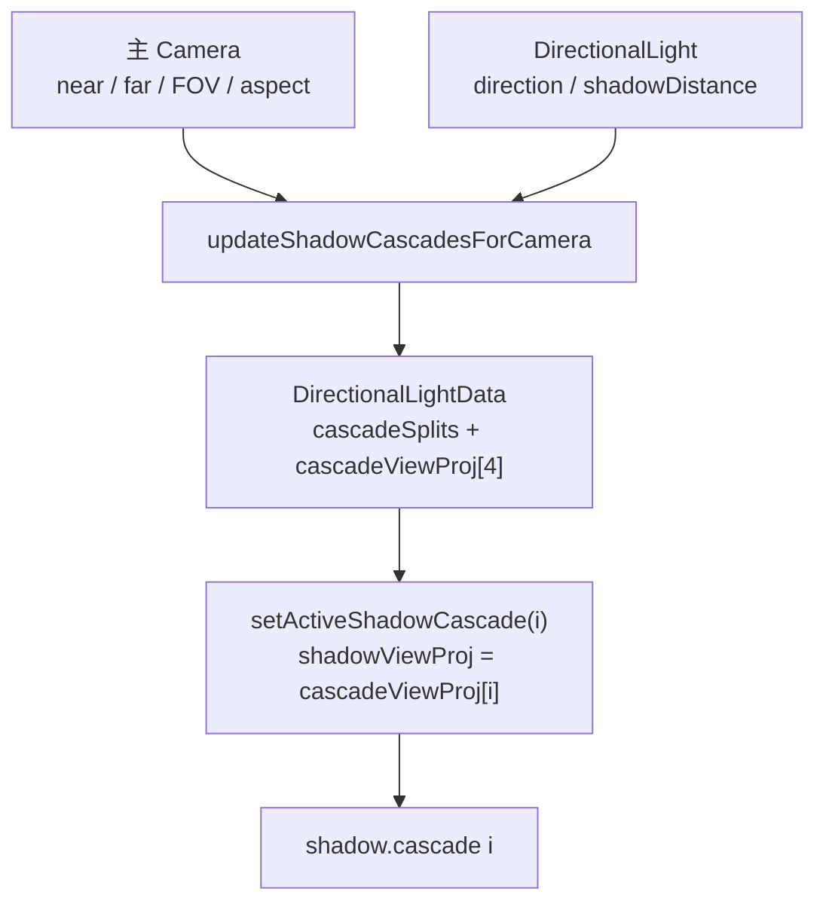
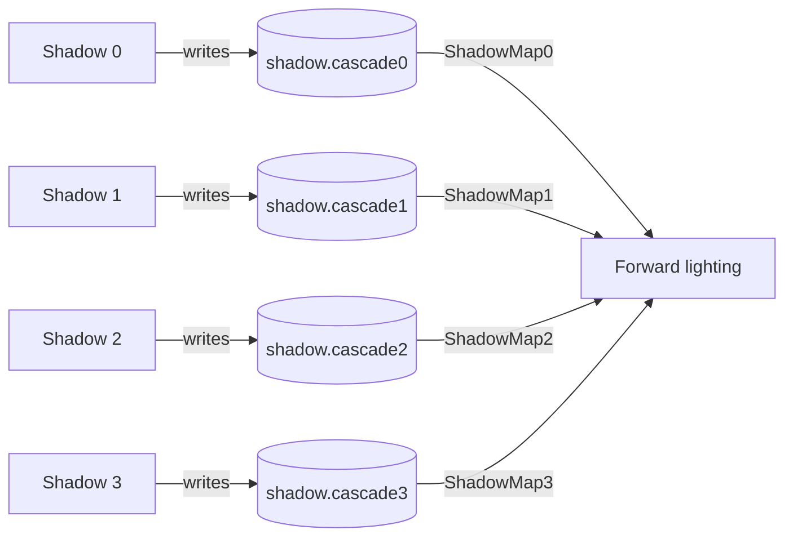

# CSM：把方向光阴影分成四段

CSM 可以想成把一张很长的深度底片切成四张短底片。近处底片覆盖范围小、细节多；远处底片覆盖范围大、细节少。这样方向光阴影能覆盖更大场景，同时保留近处精度。

当前 LXEngine 为 directional light 固定准备最多 4 个 shadow cascade。FrameGraph 会建立 4 个 shadow pass，每个 pass 写一个 `shadow.cascade*` depth resource，Forward shader 再按 view-space depth 选择要采样的 cascade。

## light 保存四段矩阵和切分点

`DirectionalLightData` 是 CPU 和 shader 之间的合同。它同时保存当前 shadow pass 使用的矩阵，以及 forward 阶段采样四张 shadow map 所需的数组。

| 字段 | 当前含义 |
|---|---|
| `shadowViewProj` | 当前正在录制的 shadow cascade 使用的矩阵 |
| `cascadeViewProj[4]` | Forward shader 用来采样四个 cascade 的矩阵 |
| `cascadeSplits` | view-space depth 切分点 |
| `shadowParams.x` | shadow map size |
| `shadowParams.y` | bias |
| `shadowParams.z` | shadow strength |
| `shadowParams.w` | cascade count |

每次 renderer 绑定 scene 时，会根据主 camera 和主 directional light 更新 cascade 数据。录制某个 shadow pass 前，renderer 调用 `setActiveShadowCascade(cascadeIndex)`，把对应 `cascadeViewProj[i]` 复制到 `shadowViewProj`。



## 四个 shadow pass 对应四张 depth resource

FrameGraph 里的 cascade 是显式 pass，不是一个 pass 内的隐式循环。这样每张 shadow map 都有自己的 resource name，Forward pass 也能明确声明读取关系。

| Cascade | Shadow pass 写出 | Forward binding |
|---|---|---|
| 0 | `shadow.cascade0` | `ShadowMap0` |
| 1 | `shadow.cascade1` | `ShadowMap1` |
| 2 | `shadow.cascade2` | `ShadowMap2` |
| 3 | `shadow.cascade3` | `ShadowMap3` |

Forward shader 根据当前像素的 view-space depth 选择 cascade：

```glsl
int cascadeIndex = selectCascade(viewDepth);
vec4 lightSpacePos =
    sceneLight.cascadeViewProj[cascadeIndex] * vec4(worldPos, 1.0);
```

这个选择发生在 shader 里。FrameGraph 只保证四张 depth map 已经先写好，并且 descriptor 能按 `ShadowMap0..3` 绑定进去。

## CSM 把 shadow pass 和 forward pass 串起来



从阅读代码的角度看，CSM 横跨三个位置：`DirectionalLight` 计算矩阵，`VulkanRenderer` 建立并执行 cascade pass，shader 根据 split 和矩阵采样 shadow map。

## 继续阅读

- [Shadow Pass：只写深度的光源视角](shadow-pass.md)
- [FrameGraph：一帧的 Pass 排程表](framegraph.md)
- [Light 源码分析](../../source_analysis/src/core/scene/scene.md)
- [Shadow 阶段教程](../../tutorial/shadow-era/index.md)
