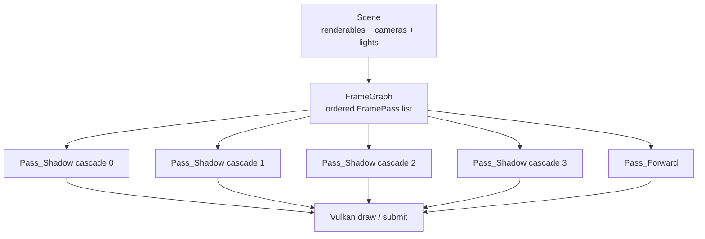

# FrameGraph：一帧的 Pass 排程表

`FrameGraph` 可以先想成生产线的排程表：它不亲自加工零件，而是记录这一帧有哪些工序、每道工序在哪个 target 上运行、读哪些半成品、写哪些半成品。

当前 LXEngine 的 `FrameGraph` 是一个显式顺序调度器。pass 加入的顺序就是执行顺序；`compile()` 会检查资源读写是否自洽，但不会自动重排 pass，也不会推导 attachment aliasing。

## 一帧先被拆成多道工序

在当前 shadow-era 路径里，renderer 初始化 scene 时会建立 4 个 shadow pass 和 1 个 forward pass。shadow pass 先写 `shadow.cascade*` depth resource，forward pass 再读取这些 resource 并写 swapchain。



| 结构 | 当前含义 | 排程表类比 |
|---|---|---|
| `FramePass::name` | `Pass_Shadow` / `Pass_Forward` 等 pass 名 | 工序名 |
| `FramePass::target` | 这道 pass 的输出 attachment 形状 | 工位规格 |
| `FramePass::reads` | 这道 pass 需要采样的前序 resource | 领用半成品 |
| `FramePass::writes` | 这道 pass 写出的 resource | 产出半成品 |
| `FramePass::queue` | 这道 pass 内的 draw item 列表 | 工序任务箱 |

## read/write 是 pass 之间的合同

FrameGraph resource name 像半成品标签。Shadow pass 写 `shadow.cascade0`，Forward pass 用同一个名字读取，并把它绑定到 shader 里的 `ShadowMap0`。

```cpp
graph.addPass(FramePass{Pass_Shadow,
                        RenderTargetDesc::offscreenDepth(ImageFormat::D32Float),
                        {},
                        {FrameGraphWrite{shadowDepth}}});

graph.addPass(FramePass{Pass_Forward,
                        RenderTargetDesc::swapchain(color, depth),
                        {FrameGraphRead::sampled(shadowDepth.name, StringID("ShadowMap0"))},
                        {FrameGraphWrite{swapchainColor},
                         FrameGraphWrite{swapchainDepth}}});
```

| Resource name | 写入者 | 读取者 | Shader binding |
|---|---|---|---|
| `shadow.cascade0` | Shadow cascade 0 | Forward | `ShadowMap0` |
| `shadow.cascade1` | Shadow cascade 1 | Forward | `ShadowMap1` |
| `shadow.cascade2` | Shadow cascade 2 | Forward | `ShadowMap2` |
| `shadow.cascade3` | Shadow cascade 3 | Forward | `ShadowMap3` |
| `swapchain.color` | Forward | Present | swapchain image |
| `swapchain.depth` | Forward | Depth test | swapchain depth |

`FrameGraphRead::sampled(resource, bindingName)` 保存的是“读哪个半成品”和“接到哪个 shader 插口”。Vulkan command buffer 录制 descriptor 时，才把 `shadow.cascade*` 解析成当前 frame 的实际 image view。

## compile 只验证合同，不替 backend 做决定

`FrameGraph::compile()` 的输出是 `CompiledFrameGraph`。它保留每个 pass 的 name、target、reads 和 writes，并报告明显错误。

| 校验 | 当前行为 |
|---|---|
| 读未写资源 | 报错 |
| 重复写同名 resource | 报错 |
| 空 resource name | 报错 |
| sampled read 的 binding name | 保留给 backend descriptor 绑定 |
| pass 顺序 | 保持声明顺序 |

这让 core 层保持轻量：FrameGraph 知道 pass 之间的资源合同，但 Vulkan image 创建、layout transition、framebuffer 绑定和 descriptor 更新都留给 backend 执行层。

## 继续阅读

- [Render Target：Pass 的输出形状](render-target.md)
- [RenderQueue：把 Scene 收敛成 Draw 列表](render-queue.md)
- [FrameGraph 源码分析](../../source_analysis/src/core/frame_graph/frame_graph.md)
- [REQ-042-a](../../requirements/finished/042-a-frame-graph-v1-resource-target-pass-execution.md)
