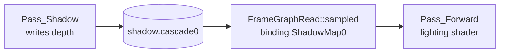

# Shadow Pass：只写深度的光源视角

Shadow pass 可以想成从灯光方向拍一张黑白深度底片。它不关心物体颜色，只记录“从光源看过去，哪个表面更近”。Forward pass 之后用这张底片判断当前像素是否被挡住。

当前内置 lit 材质同时声明 `Forward` 和 `Shadow` pass。同一个 renderable 因此会进入不同 pass 的 `RenderQueue`，分别用不同 shader、target 和 render state 提交。

## 材质文件把 shadow pass 声明出来

Shadow pass 是 material template 的一部分，不是 renderer 隐式硬编码给每个 mesh 的特殊通道。材质能否参与 shadow，由它是否支持 `Pass_Shadow` 决定。

```yaml
passes:
  Forward:                         # -> MaterialTemplate 的 Forward pass
    renderState:                   # -> MaterialPassDefinition.renderState
      cullMode: Back
      depthTest: true
      depthWrite: true
  Shadow:                          # -> MaterialTemplate 的 Shadow pass
    shader: shadow_depth_only      # -> depth-only shader family
    renderState:                   # -> shadow pass 的 render state
      cullMode: Front
      depthTest: true
      depthWrite: true
```

| YAML 字段 | Runtime 对象 | 当前含义 |
|---|---|---|
| `passes.Shadow` | `MaterialPassDefinition` | 材质支持 shadow pass |
| `shader: shadow_depth_only` | `Shader` / shader family | 使用只写 depth 的 shader |
| `cullMode: Front` | `RenderState` | shadow map 常用 front-face culling 降低阴影瑕疵 |
| `depthWrite: true` | `RenderState` | 输出 depth attachment |

## depth-only shader 只需要 light clip space

Shadow vertex shader 使用 model matrix 和 `LightUBO.shadowViewProj` 把 mesh 顶点变换到 light clip space。fragment shader 保持最小，因为 pass 输出是 depth attachment。

| 阶段 | 当前输入 | 当前输出 |
|---|---|---|
| Shadow vertex shader | model matrix、`LightUBO.shadowViewProj`、mesh position | light clip space position |
| Shadow fragment shader | 无颜色需求 | depth attachment |
| Vulkan pass | `Pass_Shadow` queue items | `shadow.cascade*` depth resource |

`LightUBO.shadowViewProj` 在单个 shadow pass 录制前会被设置为当前 cascade 的矩阵。这样同一个 shader 可以服务四个 cascade pass，只是每次 pass 的 light matrix 不同。

## shadow depth 通过 FrameGraph 交给 forward

Shadow pass 写出的 resource 不是直接传给 shader 的裸 Vulkan image，而是先登记为 `FrameGraphWrite`。Forward pass 再用 `FrameGraphRead::sampled` 声明读取。



Backend 执行时会把 shadow depth attachment transition 到 shader-read layout，并在 descriptor 录制阶段把 `ShadowMap0` 指向对应的 image view。

## 继续阅读

- [FrameGraph：一帧的 Pass 排程表](framegraph.md)
- [CSM：把方向光阴影分成四段](cascaded-shadow-maps.md)
- [Shadow 阶段教程](../../tutorial/shadow-era/index.md)
- [多 Pass 如何变成 Draw](../../concepts/material/pass-rendering-flow.md)
