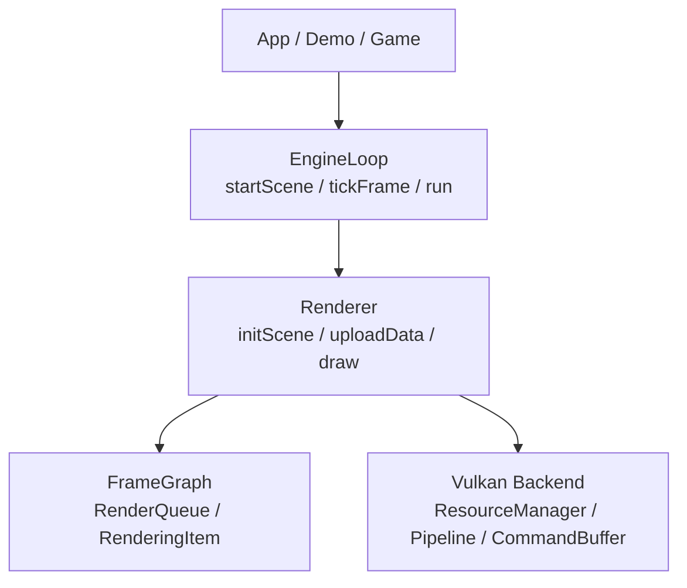

# 引擎循环

这份文档回答四个面向入门者的问题：

1. 为什么这个项目需要 `EngineLoop`，而不是让每个 demo 自己手写 while-loop。
2. `EngineLoop` 在整个架构里放在哪里，和 `Renderer` / `FrameGraph` / backend 的边界是什么。
3. 开始一个场景和执行一帧，为什么要被拆成两个阶段。
4. 作为使用者，应该怎样接入它；作为维护者，应该把什么逻辑放进它，什么不该放。

如果你是第一次接触这个概念，建议这样读：

- 先看本文，理解为什么要有 `EngineLoop`，以及它和 `Renderer` / backend 的边界。
- 再看 [`架构总览`](../architecture.md)，把它放回整个渲染数据流里。
- 最后看 [`EngineLoop 子系统`](../subsystems/engine-loop.md)，对应当前代码接口和行为细节。

如果只想先记一句话，可以先记这个：

> `EngineLoop` 是 renderer 之上的运行时编排层。它负责把“开始一个场景”和“执行一帧”组织成稳定入口，但不负责 Vulkan 细节，也不负责决定某个 pass 该怎么画。

它的价值不在于“帮你少写一个 while-loop”，而在于把引擎运行时最容易混乱的边界收敛起来：

- 场景初始化不是每帧做的事情。
- 业务层更新必须先于 `uploadData()`。
- backend 负责执行绘制，不负责主循环和通用生命周期编排。

## 它解决的核心问题

在没有 `EngineLoop` 的时候，应用层最常见的写法是：

```cpp
while (running) {
    updateScene();
    renderer->uploadData();
    renderer->draw();
}
```

这段代码本身没有错，但它很容易把几类不同性质的工作揉在一起：

- 哪些逻辑属于“开始渲染一个场景时做一次”？
- 哪些逻辑属于“每帧都做”？
- 业务层到底应该在什么时候修改 camera / material / object state？
- 如果运行时发生结构性变化，应该怎么触发 scene rebuild？

于是就会出现一个典型误解：把 `initScene()`、`FrameGraph::buildFromScene()`、`preloadPipelines()` 看成每帧路径的一部分。

这正是 `EngineLoop` 要解决的设计问题。

它把运行时组织方式明确分成两段：

- **场景启动阶段**：接管 scene，建立当前场景对应的渲染结构。
- **每帧执行阶段**：推进时钟，让业务层修改 CPU 真值，上传 dirty，再执行 draw。

这让应用层拿到的是一个更稳定的接口形状：

- `startScene(scene)`：开始一个场景
- `setUpdateHook(...)`：注册每帧业务更新
- `tickFrame()`：执行一帧
- `run()`：默认主循环薄壳
- `requestSceneRebuild()`：显式请求结构性重建

## 它在架构里的位置



这张图里最重要的是职责边界：

- `App / Demo / Game` 负责组装 scene、注册 update hook、决定什么时候开始或停止。
- `EngineLoop` 负责运行时编排顺序。
- `Renderer` 负责 scene 初始化入口，以及每帧的上传和绘制入口。
- `FrameGraph` 负责把 scene 变成可绘制结构。
- `Vulkan backend` 负责把这些结构变成真实 GPU 命令。

从设计上说，`EngineLoop` 不应该放到 backend 里，原因有三个：

- **它不是 Vulkan 专属能力**。主循环、场景生命周期、业务回调顺序，这些都是引擎层能力，不是某个图形 API 的实现细节。
- **它面对的是使用者接口**。应用层真正想调用的是“开始场景”“执行一帧”，而不是 backend 内部对象。
- **它协调的是多种对象**。`Window`、`Clock`、`Scene`、`Renderer`、业务 callback 都是它的输入，backend 只应该是其中一个被协调者。

所以它现在放在 `src/core/gpu/`，这是合理的：它属于渲染运行时的上层编排，而不是 backend 细节。

## 为什么要拆成两个阶段

### 1. 场景启动阶段

这一阶段做的是“建立当前 scene 的渲染结构”，典型顺序是：

```text
EngineLoop::startScene(scene)
  └── Renderer::initScene(scene)
        ├── 准备 RenderTarget
        ├── 回填 camera target
        ├── FrameGraph::buildFromScene(scene)
        └── preloadPipelines(...)
```

这里的工作有一个共同特征：它们依赖的是**场景结构**，不是每帧都会变化的数值。

例如：

- 这个场景里有哪些 renderable
- 有哪些 pass
- 当前 camera 对应哪个 target
- 每个 draw item 的 `PipelineKey` 是什么
- 需要预热哪些 pipeline

这些事情如果每帧都做，代价和语义都不对。它们应该在“开始一个场景”时做，或者在结构性变化发生时显式重做。

### 2. 每帧执行阶段

这一阶段做的是“消费已经建立好的渲染结构”，典型顺序是：

```text
EngineLoop::tickFrame()
  ├── clock.tick()
  ├── updateHook(scene, clock)
  ├── renderer->uploadData()
  └── renderer->draw()
```

这四步的顺序不是随意排的。

- `clock.tick()` 必须先发生，这样业务层才能拿到当前 frame 的 `deltaTime / totalTime`。
- update hook 必须在 `uploadData()` 之前，这样业务层改完 camera、light、material、push constant 后，dirty 上传才能看到最新值。
- `draw()` 必须最后执行，因为它应该只消费本帧已经准备好的数据，而不是夹带状态更新。

这个顺序看起来简单，但它其实是在把“业务更新”和“渲染执行”切开。对于引擎来说，这是一条很重要的防线。

## 设计考虑

### 设计考虑 1：backend 只做执行，不做编排

backend 最容易膨胀成“什么都往里塞”的地方，因为它最终会接触 GPU。但从维护角度看，backend 应该尽量只做两类事：

- 初始化一个已经定义好的场景渲染结构
- 执行上传和绘制

如果把主循环、业务 hook、时钟推进、场景生命周期切换都塞进 backend，会带来两个问题：

- 上层使用者只能从 Vulkan 视角理解整个引擎接口
- backend 逐渐变成同时负责“策略”和“执行”的大对象，难以演进

`EngineLoop` 的引入，本质上是在守住这条边界。

### 设计考虑 2：结构性变化和 dirty 变化要分开

不是所有运行时变化都应该触发 `initScene()`。

有些变化只是数值更新：

- 相机位置变化
- 灯光方向变化
- material UBO 参数变化
- object push constant 变化

这些都应该走：

```text
update hook -> resource.setDirty() -> uploadData() -> draw()
```

但有些变化会改变 scene 的渲染结构：

- 新增或删除 renderable
- 改变对象参与的 pass
- 切换 material / shader 组合，导致 pipeline 身份变化
- 改变 camera target，导致 queue 过滤结果变化

这些变化不应该靠“每帧偷偷重建”来掩盖，而应该显式表达成：

```cpp
loop.requestSceneRebuild();
```

这能把代价暴露出来，也让调用者知道自己触发的是哪一种级别的变化。

### 设计考虑 3：接口要让新使用者不容易写错

如果直接暴露给用户的是：

- `renderer->initScene(scene)`
- `renderer->uploadData()`
- `renderer->draw()`

那么每个 demo 都要自己决定：

- 什么时候 init
- update 放哪
- clock 放哪
- 什么时候 stop
- scene rebuild 怎么处理

这会导致“每个样例都能跑，但写法都不一样”。

`EngineLoop` 的意义之一，就是把推荐入口形状统一下来，让 tutorial、sample、未来的 gameplay 层都能基于同一套时序。

## 例子

### 例子 1：最小接入

这是一个推荐的使用形状：

```cpp
EngineLoop loop;
loop.initialize(window, renderer);
loop.startScene(scene);
loop.setUpdateHook([&](Scene& scene, const Clock& clock) {
    camera->position = {0.0f, 0.8f, 2.5f};
    camera->target   = {0.0f, 0.0f, 0.0f};
    camera->updateMatrices();

    PC_Draw pc{};
    pc.model = Mat4f::rotationY(clock.totalTime() * 0.8f);
    renderable->objectPC->update(pc);
});
loop.run();
```

这个例子里：

- scene 初始化只发生一次
- 旋转角度来自 `Clock`
- 每帧业务更新被固定放在 upload 之前
- 应用层不再自己手写 while-loop

这正是 tutorial 和 demo 应该优先展示的形状。

### 例子 2：只改数值，不重建 scene

如果业务层只是改材质参数：

```cpp
loop.setUpdateHook([&](Scene&, const Clock& clock) {
    float roughness = 0.5f + 0.4f * std::sin(clock.totalTime());
    material->setFloat(StringID("roughness"), roughness);
    material->updateUBO();
});
```

这类变化只会让 UBO 变 dirty。它不需要重新 `initScene()`，因为 scene 的绘制结构没有变。

### 例子 3：发生结构性变化时显式重建

如果某一帧里新增了一个 renderable：

```cpp
scene->addRenderable(newRenderable);
loop.requestSceneRebuild();
```

这样下一个 `tickFrame()` 开始时，`EngineLoop` 会重新走一次场景初始化路径，把新的 renderable 纳入 `FrameGraph / RenderQueue / RenderingItem`。

这比“每帧全量重建”更合理，因为它把结构性变化变成了显式操作。

## 应该放进 EngineLoop 的东西

适合放进 `EngineLoop` 的，是**运行时编排策略**：

- 场景生命周期切换
- 每帧固定顺序
- `Clock` 推进
- update hook 调用
- run / stop 语义
- 显式 scene rebuild 协调

## 不应该放进 EngineLoop 的东西

不适合放进去的，是**和具体渲染实现或业务内容强绑定的逻辑**：

- Vulkan pipeline / descriptor / command buffer 细节
- `FrameGraph` 内部如何构建 item
- 业务层自己的 gameplay 规则
- 某个 demo 专属的输入逻辑或镜头逻辑

一个简单判断方式是：

- 如果它是在回答“这一帧什么时候做什么”，偏向 `EngineLoop`
- 如果它是在回答“这一步具体怎么画”，偏向 renderer / backend
- 如果它是在回答“游戏逻辑要改什么数据”，偏向业务层

## 和其他文档怎么配合看

如果你是第一次进入这个项目，推荐按这个顺序读：

1. 本文：`notes/concepts/engine-loop.md`
2. [架构总览](../architecture.md)
3. [EngineLoop 子系统](../subsystems/engine-loop.md)
4. [FrameGraph 子系统](../subsystems/frame-graph.md)
5. [Vulkan Backend 子系统](../subsystems/vulkan-backend.md)

可以这样理解它们的关系：

- 本文回答“为什么要有 `EngineLoop`，它在设计上解决什么问题”。
- `架构总览` 回答“整个渲染器分层和数据流长什么样”。
- `subsystems/engine-loop.md` 回答“`EngineLoop` 现在的接口和行为细节是什么”。

## 一句话总结

`EngineLoop` 不是为了包装一个 while-loop，而是为了把场景启动、每帧执行、业务更新、dirty 上传和绘制命令之间的边界讲清楚，并给使用者一个不容易写错的引擎入口。

## 常见误区

### 误区 1：`initScene()` 应该每帧都跑

不应该。

`initScene()` 处理的是场景启动期工作，例如：

- 根据当前 scene 建立 `FrameGraph`
- 为每个 pass 构建 `RenderQueue`
- 收集 `PipelineBuildDesc`
- 预构建 pipelines

这些逻辑依赖的是场景结构，而不是每帧变化的数值。如果把它们放进 per-frame 路径，会有两个直接后果：

- 做了很多本来不该每帧重复做的工作
- 把“dirty 更新”和“结构重建”混成同一种操作，调用者不知道自己付出了什么代价

正确理解是：

- `initScene()` 属于 `startScene(scene)` 的初始化路径
- 只有在发生结构性变化时，才应该通过 `requestSceneRebuild()` 触发重新初始化

### 误区 2：update hook 放在 `draw()` 后面也可以

一般不可以。

如果 update hook 放在 `draw()` 后，本帧业务层做的修改要么：

- 本帧根本看不到
- 要么你就得在 `draw()` 之后再补一轮上传，导致流程变脏

推荐顺序必须是：

```text
clock.tick()
-> updateHook(scene, clock)
-> uploadData()
-> draw()
```

它对应的是一条很明确的语义链：

- `clock.tick()` 产生当前帧时间
- update hook 用当前帧时间修改 CPU 真值
- `uploadData()` 把本帧 dirty 推到 GPU
- `draw()` 消费本帧已经准备好的数据

这样每一帧都是闭合的，不需要靠“下一帧才生效”或“draw 后补同步”来兜底。

### 误区 3：只要数据变了，就算 structural change

不是。

`EngineLoop` 里最重要的判断之一，就是区分：

- **dirty-only change**：只改数值，不改渲染结构
- **structural change**：会改变 scene 初始化产物

典型的 dirty-only change：

- 相机位置、朝向、FOV 变化
- 灯光颜色、方向、强度变化
- material UBO 参数变化
- push constant 里的 model 矩阵变化

这些变化通常只需要：

```text
setDirty() -> uploadData() -> draw()
```

典型的 structural change：

- 新增或删除 renderable
- 对象参与的 pass 发生变化
- shader / material 组合变化，导致 `PipelineKey` 变化
- camera target 或 scene-level 过滤条件变化，导致 queue 构成变化

这些变化应该让调用者显式表达：

```cpp
loop.requestSceneRebuild();
```

简单说：

- 改的是“值”，通常是 dirty-only
- 改的是“这一帧应该画什么、怎么分 pass、会命中哪条 pipeline”，通常是 structural

### 误区 4：`EngineLoop` 既然在最上层，就应该把所有运行时逻辑都塞进去

也不对。

`EngineLoop` 负责的是**编排**，不是所有运行时逻辑的总集散地。它应该关心的是：

- 什么时候开始一个场景
- 一帧内固定顺序是什么
- 什么时候 stop
- 什么时候触发 scene rebuild

但它不应该吞掉：

- backend 内部的 Vulkan 细节
- `FrameGraph` / `RenderQueue` 的具体构造逻辑
- 业务层自己的 gameplay 规则
- 某个 demo 专属输入系统

否则它会从“统一入口”膨胀成“全能管理器”，最后把边界重新打乱。
