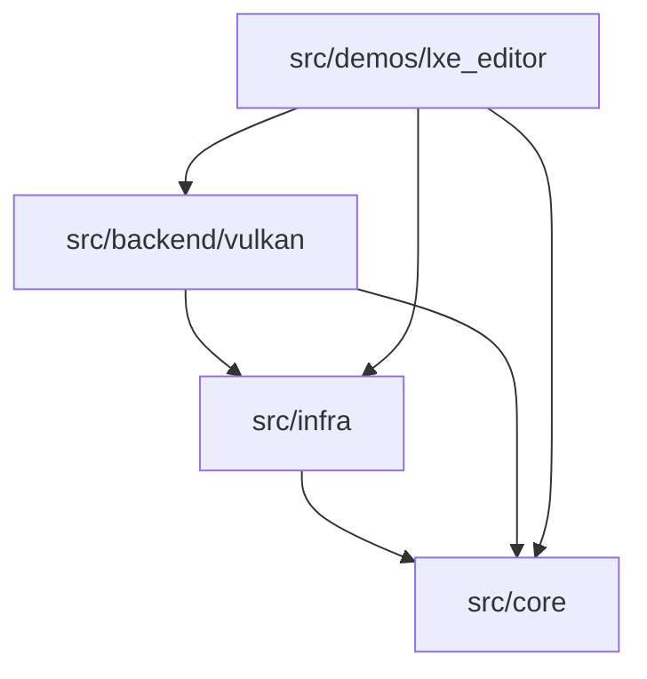

# REQ-043-b: v0.1.1 — 架构概念文档展开与 Mermaid 图

## 背景

`notes/concepts-design/architecture.md` 已经建立“三层、两段、一条 draw 主线”的入口，但 v0.1.1 完成 FrameGraph / shadow / CSM 后，架构文档需要能帮助读者回答更具体的问题：

- 一段代码属于 `core`、`infra` 还是 `backend`？
- Scene、FrameGraph、RenderQueue、Pipeline、Vulkan backend 的边界在哪里？
- 多 pass shadow 的数据流如何跨模块移动？
- Editor、tutorial、requirements 与 runtime 架构是什么关系？

本需求只改文档，不实现引擎功能。

## 目标

1. 展开架构概念文档，解释系统和模块归属。
2. 增加 Mermaid 图，帮助读者从全局理解代码组织。
3. 把 FrameGraph / shadow / CSM 完成后的架构事实写清楚。
4. 明确 pending 能力不是当前事实。

## 需求

### R1: Layer dependency diagram

在架构文档中增加三层依赖图：



实际文档可以调整节点名，但必须表达 core 不反向依赖 infra/backend。

### R2: Runtime render flow diagram

增加从 scene 到 GPU submit 的主流程 Mermaid 图，覆盖：

- Scene / SceneNode。
- FrameGraph。
- RenderQueue。
- PipelineBuildDesc / PipelineCache。
- VulkanRenderer / command buffer。

### R3: Multi-pass shadow flow diagram

在 `REQ-042-a/b/c` 完成后增加 shadow-era 数据流：

```text
Scene + DirectionalLight
  -> Shadow pass writes shadow.depth
  -> Forward pass reads shadow.depth
  -> Swapchain present
```

Mermaid 图需要表达 resource read/write，而不是只画函数调用。

### R4: Module ownership table

提供模块归属表：

| 系统 | 主要目录 | 当前职责 | 不负责什么 |
|---|---|---|---|
| Scene | `src/core/scene/` | runtime object graph | Vulkan submission |
| FrameGraph | `src/core/frame_graph/` | pass/resource plan | shader 编译 |
| Vulkan backend | `src/backend/vulkan/` | GPU resource / command | scene authoring |

表格应覆盖至少 Scene、Asset/Material、FrameGraph、Pipeline、Backend、Editor、Notes/Requirements。

### R5: Pending 能力边界

架构文档提到以下能力时必须标注 pending：

- HDR/Post。
- PBR 完整管线。
- G-Buffer/Deferred。
- Task-based pass build。
- Web Editor。
- Engine CLI/MCP。
- AssetRegistry/hot reload。

### R6: 写作风格

文档必须符合 `openspec/specs/notes-writing-style/spec.md`：

- 使用“我们”叙述。
- 用类比引出抽象概念。
- 结构性内容使用表格。
- 继续阅读链接控制在 2–4 个。

### R7: 验证

覆盖：

- notes site build 成功。
- Mermaid code block 语法基本有效。
- 链接不指向已移动的 active requirement 旧路径。
- 文档不把 pending 内容描述成当前能力。

## 修改范围

- `notes/concepts-design/architecture.md`
- `notes/concepts-design/project-layout.md`
- `notes/concepts-design/index.md`
- `notes/nav.yml` 如需同步
- 相关 source analysis / subsystem 链接

## 边界与约束

- 本 REQ 不改 C++ 代码。
- 本 REQ 不生成完整 API reference。
- 本 REQ 不把后续 roadmap 写成当前事实。
- 本 REQ 在 `REQ-042-a/b/c` 完成后按真实代码更新。

## 依赖

- `REQ-042-a`
- `REQ-042-b`
- `REQ-042-c`

## 后续工作

v0.1.1 之后，如果 HDR/Post、G-Buffer 或 Task-based pass build 进入 active，需要再更新架构图。

## 实施状态

已实现。

落地内容：

- 重写 `notes/concepts-design/architecture.md`，补充三层依赖图、runtime render flow、shadow / CSM resource flow、pipeline identity flow 和模块 ownership 表。
- 更新 `notes/concepts-design/index.md`、`notes/concepts-design/project-layout.md`，把 FrameGraph / shadow / CSM 的当前事实纳入入口说明。
- 修正 `notes/subsystems/vulkan-backend.md`、`notes/concepts/material/pass-rendering-flow.md`、`notes/scene-system/light.md` 中与 shadow-era 相关的事实。
- 文档中将 HDR/Post、PBR 完整管线、G-Buffer/Deferred、task-based pass build、Web Editor、Engine CLI/MCP、AssetRegistry / hot reload 标注为 pending 或未实现边界。

验证：

- `scripts/notes/serve_site.sh --build`
- `rg -n "你|不再|旧的|已经去掉|已过期" notes/tutorial/shadow-era notes/concepts-design/architecture.md notes/concepts-design/index.md notes/concepts-design/project-layout.md notes/scene-system/light.md notes/subsystems/vulkan-backend.md notes/concepts/material/pass-rendering-flow.md`
