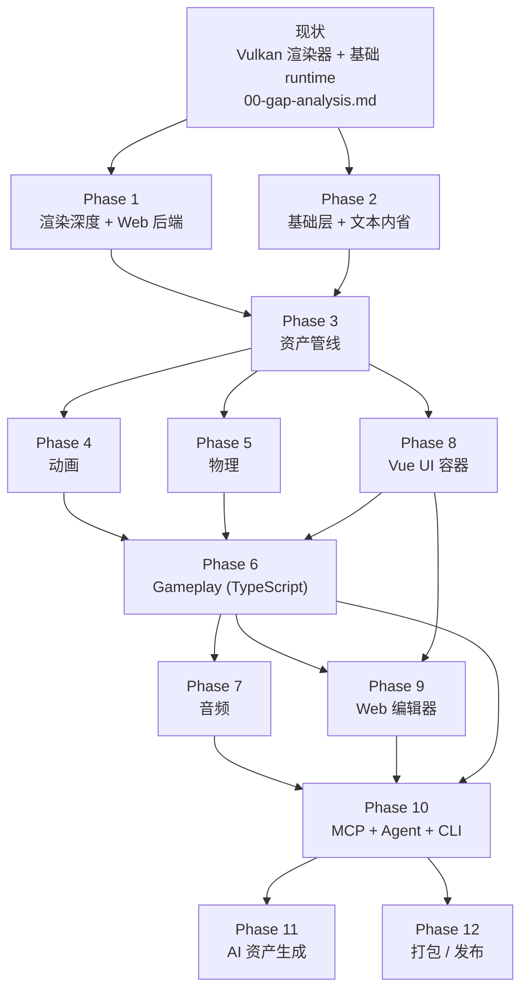

# Roadmap · LXEngine 走向 AI-Native 小型游戏引擎

> 目标：把当前的 Vulkan 教学渲染器推进到一个 **AI-Native 小型游戏引擎**。
> 本文件是整份 roadmap 的入口和阅读地图。

## AI-Native 的定义

传统引擎把**人类开发者**当作唯一的一等用户：专有编辑器、可视化脚本、GUI-only 工作流。AI-Native 把**AI Agent 和人**当作平权使用者。对应 5 条硬性约束：

1. **引擎内置 Agent + Skills**：CLI / 运行时内嵌长驻 agent，暴露结构化 skills。
2. **默认 MCP 接入**：引擎暴露标准 [Model Context Protocol](https://modelcontextprotocol.io/) 接口。
3. **文本优先内省**：scene tree / 组件 / 资产 / 管线状态统一暴露为 JSON / YAML / DSL 文本。
4. **AI 友好的技术栈**：游戏脚本走 **TypeScript**；UI 走 **Vue 子集 + HTML/JS**；编辑器走 **Web + WebGL/WebGPU**。
5. **AI 深度参与资产生产**：集成文本→贴图 / 文本→3D / 文本→动画 / NeRF / 3DGS 生成管线。

架构级的 20 条不变量见 [principles.md](principles.md)。

## 当前聚焦路径（2026-04-24）

| 顺序 | 目标 | 对应 phase / REQ |
|------|------|-------------------|
| 1 | **PBR 完整管线**（IBL ambient + shadow + 多光源 + 完整贴图集） | Phase 1 REQ-118 |
| 2 | **IBL scene-level 资源 + 预过滤** | Phase 1 REQ-105 / REQ-106 |
| 3 | **G-Buffer / 延迟渲染** | Phase 1 REQ-119 |
| 4 | 引擎 CLI + agent 入口 | Phase 10 REQ-1004 |
| 5 | **NeRF / 3DGS 接入**（AI 资产生成优先项） | Phase 11 REQ-1102 |
| 6 | 角色全链路：立绘 → 3D 模型 → 骨骼 → 动作 | Phase 11 REQ-1103 ~ REQ-1106 |
| 7 | 游戏 UI 生成 | Phase 11 REQ-1107 |
| 8 | 通用贴图 / 3D / 环境兜底 | Phase 11 REQ-1108 |

其他阶段（Phase 2–9 / Phase 12）按 roadmap 原依赖顺序协同推进。

## 当前实施进度快照（2026-04-24）

| Phase | 状态 | 已落地关键能力 | 主要缺口 |
|-------|------|----------------|----------|
| [Phase 1](phase-1-rendering-depth.md) 渲染深度 + Web 后端 | 部分开工 | `FrameGraph` / `RenderQueue` / `PipelineCache` / 多 pass 骨架；`Camera::cullingMask` + `SceneNode::visibilityLayerMask` 交集过滤；通用 `.material` YAML loader + `pbr_gold.material` 示例；ImGui overlay；SDL3 路径 | Shadow / CSM / Bloom / FXAA / IBL / PointLight + SpotLight / 多光源 GPU 合同 / 视锥剔除 / WebGPU / WebGL2 / Headless |
| [Phase 2](phase-2-foundation-layer.md) 基础层 + 文本内省 | 部分开工 | `Clock`（`src/core/time/clock.*`）；`EngineLoop`（`src/core/gpu/engine_loop.*`）；`IInputState` / `Sdl3InputState` / `DummyInputState` / `MockInputState`；Orbit + FreeFly 控制器；ImGui + debug panel helper | Transform 层级 / Action mapping / Gamepad / `dumpScene` / AABB + 空间索引 |
| [Phase 3](phase-3-asset-pipeline.md) 资产管线 | 未开工 | 资产目录 + `cdToWhereAssetsExist` | GUID / 序列化 / 热重载 |
| [Phase 4](phase-4-animation.md) 动画 | 未开工 | `Skeleton` / `SkeletonUBO`（`src/core/asset/skeleton.*`） | 动画 clip / 播放器 / 状态机 / 混合 |
| [Phase 5](phase-5-physics.md) 物理 | 未开工 | — | 刚体 / 射线 / 角色控制器 |
| [Phase 6](phase-6-gameplay-layer.md) Gameplay (TypeScript) | 未开工 | — | TS runtime / 组件 / 事件总线 |
| [Phase 7](phase-7-audio.md) 音频 | 未开工 | — | 全部 |
| [Phase 8](phase-8-web-ui.md) Vue UI 容器 | 未开工 | — | HTML/JS 容器 + Vue 子集 |
| [Phase 9](phase-9-web-editor.md) Web 编辑器 | 未开工 | — | 全部 |
| [Phase 10](phase-10-ai-agent-mcp.md) MCP + Agent + CLI | 未开工 | — | 全部 |
| [Phase 11](phase-11-ai-asset-generation.md) AI 资产生成 | 未开工 | — | 全部 |
| [Phase 12](phase-12-release.md) 打包 / 发布 | 未开工 | — | 全部 |

唯一活跃的 `notes/requirements/` 条目：[`REQ-019` demo_scene_viewer](../../requirements/019-demo-scene-viewer.md)（仅剩显示环境下的人工验收）。其他历史 REQ 均已归档或下沉到本 roadmap 的对应 phase。

## 阶段依赖图

**并行窗口**：

- Phase 1 + Phase 2 + Phase 8 可三路并行。
- Phase 4 + Phase 5 + Phase 8 在 Phase 2/3 落地后同样并行。
- Phase 10 之后，Phase 11 与 Phase 12 并行。

## 阶段索引

| Phase | 标题 | 一句话目标 | 依赖 |
|-------|------|----------|------|
| [principles](principles.md) | **AI-Native 架构原则（宪法）** | 跨阶段的 20 条架构不变量 | — |
| [00](00-gap-analysis.md) | Gap Analysis | 盘点当前状态与 AI-Native 小型游戏引擎的差距 | — |
| [1](phase-1-rendering-depth.md) | 渲染深度 + Web 后端 | shadow / IBL / HDR + WebGPU / WebGL2 后端 | 现状 |
| [2](phase-2-foundation-layer.md) | 基础层 + 文本内省 | transform / input / time + `dumpScene` | 现状 |
| [3](phase-3-asset-pipeline.md) | 资产管线 | GUID + 序列化 + 热重载 | Phase 2 |
| [4](phase-4-animation.md) | 动画 | 骨骼动画 + 状态机 | Phase 2 / 3 |
| [5](phase-5-physics.md) | 物理 | 刚体 / 射线 / 角色 | Phase 2 |
| [6](phase-6-gameplay-layer.md) | Gameplay (TypeScript) | 组件 + TS 脚本 + 事件总线 | Phase 2 / 3 / 4 / 5 |
| [7](phase-7-audio.md) | 音频 | 3D 声场 + mixer | Phase 2 / 3 |
| [8](phase-8-web-ui.md) | Vue UI 容器 | HTML + Vue 子集 | Phase 1 / 6 |
| [9](phase-9-web-editor.md) | Web 编辑器 | 浏览器内编辑器 + WebSocket IPC | Phase 1 / 2 / 8 |
| [10](phase-10-ai-agent-mcp.md) | MCP + Agent + CLI | 引擎内置 agent，暴露 MCP tools | Phase 2 / 3 / 6 / 9 |
| [11](phase-11-ai-asset-generation.md) | AI 资产生成 | 贴图 / 模型 / 动画 / NeRF / 3DGS 生成管线 | Phase 3 / 10 |
| [12](phase-12-release.md) | 打包 / 发布 | Win / Linux / WASM 三目标 | 全部 |
| [研究留档](../research/README.md) | 技术预研 | 暂不进入 phase 的长期技术方向 | — |

## 如何阅读

- **从零开始**：先读本文件 → [principles.md](principles.md) → [00-gap-analysis.md](00-gap-analysis.md) → 按序浏览 phase。
- **只关心 AI-Native 核心**：[Phase 10](phase-10-ai-agent-mcp.md) → [Phase 2 内省部分](phase-2-foundation-layer.md) → [Phase 6](phase-6-gameplay-layer.md) → [Phase 11](phase-11-ai-asset-generation.md) → [Phase 9](phase-9-web-editor.md)。
- **只想动手**：图形优先走 Phase 1；游戏逻辑优先走 Phase 2 / 3 / 6。

## 实施原则

- `core/` 不 include `infra/` / `backend/`；构造函数注入，禁止 setter DI。
- 每个新增能力先写 `openspec/specs/<capability>/spec.md`，再实现。
- 不追求“完整”，追求“够用”。
- **优先描述接口和能力，具体库 / 算法 / 协议视作可替换选型。** roadmap 不锁定具体实现，方便未来重构。
