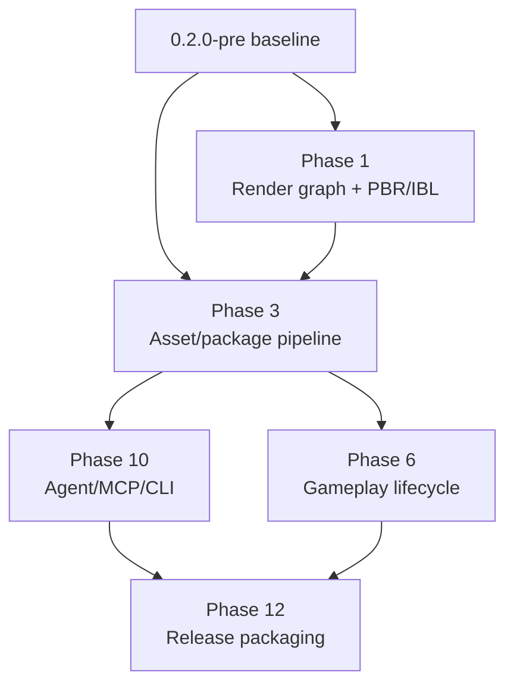

# Roadmap · 0.2.0-pre 之后

`0.2.0-pre` 是当前基线。它已经包含 `src/editor/` 主入口、RenderPathGraph / FrameGraph / RenderWorkCompiler 单轨渲染输入、PBR + IBL bake runtime、offline compute renderer、CommandBus/API/MCP 可观察入口，以及默认关闭的新 track。

Roadmap 现在只写未来路线和当前缺口；已经落地的能力放进 [v0.2.0-pre 发布记录](../../releases/v0.2.0-pre/CHANGELOG.md)，不在这里重复维护。

## 当前主线

| 主线 | 为什么排在前面 | 当前边界 |
|---|---|---|
| Render graph execution 收口 | realtime/offline 已共享 compiler，但 backend attachment/barrier/diagnostics 仍需要继续收敛 | 不重新引入旧 queue/item |
| PBR / IBL / RenderFeature 参数合同 | 当前 feature 词表已经稳定，下一步是减少手写 builder 和 runtime fallback | feature asset 是事实源 |
| SceneResourceTable 与 package load | 大资产、offline、IBL bake、future bindless 都依赖 typed handle 和 upload view | 不让 editor UI 状态进入 table |
| Agent / MCP 正式入口 | manager MCP 已能调试 editor；后续需要 engine-level capability manifest | manager 仍是工具层，不等于 engine API |

## 阶段地图

| Phase | 文档 | 当前角色 |
|---|---|---|
| 0 | [Gap Analysis](00-gap-analysis.md) | 0.2.0-pre 之后的真实缺口 |
| 1 | [Rendering Depth](phase-1-rendering-depth.md) | 渲染图执行、PBR/IBL、post/deferred/offline 统一 |
| 2 | [Foundation Layer](phase-2-foundation-layer.md) | 输入、时间、结构化内省、空间查询 |
| 3 | [Asset Pipeline](phase-3-asset-pipeline.md) | AssetRegistry、`.meta`、热重载、导入与 package |
| 4 | [Animation](phase-4-animation.md) | Skeleton 之后的 clip/player/state machine |
| 5 | [Physics](phase-5-physics.md) | CPU 物理优先，GPU 物理后置 |
| 6 | [Gameplay](phase-6-gameplay-layer.md) | 游戏逻辑生命周期和脚本层 |
| 7 | [Audio](phase-7-audio.md) | 最小音频系统 |
| 8 | [Web UI](phase-8-web-ui.md) | 游戏内 HTML/Vue 子集 UI |
| 9 | [Web Editor](phase-9-web-editor.md) | 浏览器编辑器 shell |
| 10 | [Agent / MCP / CLI](phase-10-ai-agent-mcp.md) | AI-native 入口 |
| 11 | [AI Asset Generation](phase-11-ai-asset-generation.md) | 生成资产接入 |
| 12 | [Release](phase-12-release.md) | 打包、shader 预编译、发布 |

## 依赖图

```mermaid
flowchart TD
    base["0.2.0-pre baseline"]
    render["Phase 1<br/>Render graph + PBR/IBL"]
    assets["Phase 3<br/>Asset/package pipeline"]
    agent["Phase 10<br/>Agent/MCP/CLI"]
    gameplay["Phase 6<br/>Gameplay lifecycle"]
    release["Phase 12<br/>Release packaging"]

    base --> render
    base --> assets
    render --> assets
    assets --> agent
    assets --> gameplay
    agent --> release
    gameplay --> release
```

## 继续阅读

- [Gap Analysis](00-gap-analysis.md)
- [Phase 1 · Rendering Depth](phase-1-rendering-depth.md)
- [v0.2.0-pre 发布记录](../../releases/v0.2.0-pre/CHANGELOG.md)
