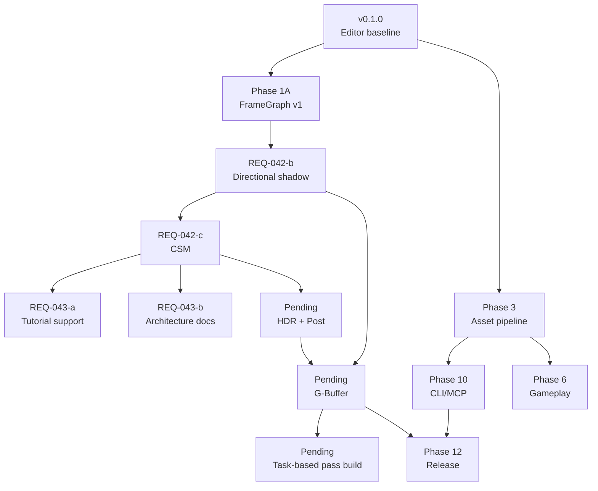

# Roadmap · v0.1.1 主线

> 本目录只写未来路线和当前缺口。已经落地的能力沉淀到 [v0.1.0 发布记录](../../releases/v0.1.0/CHANGELOG.md)，不在 roadmap 里重复维护。

LXEngine 当前已经有可交互的 `lxe_editor`、scene document、组件化场景对象、多类型光源数据、材质参数覆盖、通用 `.material` loader、pass-aware `RenderQueue` 和 pipeline cache。v0.1.1 的目标是把渲染路径推进到真正的多 pass：先完成 FrameGraph v1，再做 directional shadow，近期队列支持到 CSM 截止。

## 当前决策：v0.1.1 到 CSM 截止

我们现在面对的是两条看似都重要的路线：

| 路线 | 能解决什么 | 对 shadow / G-Buffer 的关系 | 当前决策 |
|---|---|---|---|
| FrameGraph v1 | offscreen target、pass 输入输出、同 queue barrier、pass 执行顺序 | shadow map、HDR scene color、G-Buffer 都需要跨 pass 资源流转 | **先做** |
| Task-based 并行 | CPU 侧多线程构建 pass、录制 command、资源上传调度 | 需要稳定 pass work unit 和资源依赖图，否则后续会返工 | **后做** |

原因很直接：shadow 的第一步是“Shadow pass 写 depth texture，Forward pass 读它”；G-Buffer 的第一步是“Geometry pass 写多张 attachment，Lighting pass 读它们”。这两个能力的阻塞点都是资源图和 attachment 生命周期，不是 CPU 并行。

因此 v0.1.1 主线选择：

```text
RenderTarget/FrameGraph v1
  -> 单方向光 shadow
  -> CSM
```

HDR + tone map、G-Buffer / deferred、task-based pass build、async compute、Web Editor、Engine CLI/MCP、AssetRegistry 热重载都不是放弃，而是移出当前 active 队列。这样 v0.1.1 开发只围绕 FrameGraph / shadow / CSM 收敛。

## 近期实施队列

| 顺序 | 主题 | 为什么现在做 |
|---|---|---|
| 1 | `REQ-042-a` FrameGraph v1：resource / target / pass execution | shadow 和后续多 pass 的共同前置 |
| 2 | `REQ-042-b` Directional shadow map | 最小真实 multiple pass 功能，视觉反馈强 |
| 3 | `REQ-042-c` CSM | 让 directional shadow 在真实场景尺度可用 |
| 4 | `REQ-043-a` Shadow 阶段教程支撑 | 完成 1-3 后，把教程需要的场景/说明补齐 |
| 5 | `REQ-043-b` 架构概念文档展开与 Mermaid 图 | 让读者能理解代码属于架构中的哪个系统和模块 |

原教程扩展、OBJ 材质槽、Web Editor、Engine CLI/MCP、AssetRegistry 热重载需求已移入 `notes/requirements/pending/`。HDR/Post、PBR 完整管线、G-Buffer/Deferred、Task-based 并行只保留在后续 roadmap 中，不进入 v0.1.1 active requirements。

## 阶段地图

| Phase | 文档 | 角色 |
|---|---|---|
| 0 | [Gap Analysis](00-gap-analysis.md) | v0.1.0 之后的当前缺口 |
| 1 | [Rendering Depth](phase-1-rendering-depth.md) | v0.1.1 主线：FrameGraph v1、shadow、CSM |
| 1.5 | [v0.1.0 Editor Baseline](phase-1.5-imgui-editor-mvp.md) | 已完成历史入口，详细内容见 release |
| 2 | [Foundation Layer](phase-2-foundation-layer.md) | 输入、时间、文本内省、空间查询 |
| 3 | [Asset Pipeline](phase-3-asset-pipeline.md) | AssetRegistry、`.meta`、热重载、导入 |
| 4 | [Animation](phase-4-animation.md) | Skeleton 之后的 clip/player/state machine |
| 5 | [Physics](phase-5-physics.md) | CPU 物理优先，GPU 物理后置 |
| 6 | [Gameplay](phase-6-gameplay-layer.md) | TypeScript 逻辑层 |
| 7 | [Audio](phase-7-audio.md) | 最小音频系统 |
| 8 | [Web UI](phase-8-web-ui.md) | 游戏内 HTML/Vue 子集 UI |
| 9 | [Web Editor](phase-9-web-editor.md) | 浏览器编辑器 shell |
| 10 | [Agent / MCP / CLI](phase-10-ai-agent-mcp.md) | AI-native 入口 |
| 11 | [AI Asset Generation](phase-11-ai-asset-generation.md) | 生成资产接入 |
| 12 | [Release](phase-12-release.md) | 打包、shader 预编译、发布 |

## 依赖图


```mermaid
flowchart TD
    v010["v0.1.0<br/>Editor baseline"]
    fg["Phase 1A<br/>FrameGraph v1"]
    shadow["REQ-042-b<br/>Directional shadow"]
    csm["REQ-042-c<br/>CSM"]
    tutorial["REQ-043-a<br/>Tutorial support"]
    arch["REQ-043-b<br/>Architecture docs"]
    hdr["Pending<br/>HDR + Post"]
    gbuf["Pending<br/>G-Buffer"]
    task["Pending<br/>Task-based pass build"]
    assets["Phase 3<br/>Asset pipeline"]
    cli["Phase 10<br/>CLI/MCP"]
    gameplay["Phase 6<br/>Gameplay"]
    release["Phase 12<br/>Release"]

    v010 --> fg
    fg --> shadow
    shadow --> csm
    csm --> tutorial
    csm --> arch
    csm --> hdr
    shadow --> gbuf
    hdr --> gbuf
    gbuf --> task
    v010 --> assets
    assets --> cli
    assets --> gameplay
    cli --> release
    gbuf --> release
```

## 与研究文档的关系

研究文档提供方案池，不等于当前实施承诺：

| 研究目录 | 何时进入主线 |
|---|---|
| [frame-graph](../research/frame-graph/README.md) | 现在进入，取 v1 子集：resource/target/pass/barrier |
| [shadows](../research/shadows/README.md) | Shadow pass 立项时进入，先单 directional + CSM |
| [pipeline-cache](../research/pipeline-cache/README.md) | pipeline 创建变慢或发布预编译时进入 |
| [bindless-texture](../research/bindless-texture/README.md) | deferred + 材质组合增多后进入，不作为 shadow 前置 |
| [multi-threading](../research/multi-threading/README.md) | FrameGraph v1 稳定后，接 task-based pass build |
| [async-compute](../research/async-compute/README.md) | 有 compute pass 或 GPU 物理/粒子后进入 |
| [gpu-driven-rendering](../research/gpu-driven-rendering/README.md) | G-Buffer / 多光源压力显现后进入 |
| [temporal-techniques](../research/temporal-techniques/README.md) | HDR/post/deferred 稳定后进入 |
| [ray-tracing](../research/ray-tracing/README.md) | 桌面加分项，远期 |

## 继续阅读

- [Phase 1 · Rendering Depth](phase-1-rendering-depth.md)
- [Gap Analysis](00-gap-analysis.md)
- [v0.1.0 CHANGELOG](../../releases/v0.1.0/CHANGELOG.md)
- [Frame Graph 技术调研](../research/frame-graph/README.md)
