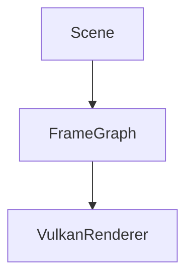

# Notes 工具链说明

这份文档解释 `notes/` 站点是怎么工作的，哪些部分是自动生成的，哪些部分仍然需要手工维护，以及如果想改成更适合自己阅读习惯的样子，应该改哪里。

## 目标

这套工具链要解决四件事：

1. 把 `notes/` 作为项目的人类可读入口。
2. 把 `docs/requirements/` 下仍在进行中的需求文档自动挂进站点。
3. 保证本地预览时，文档修改能尽快反映到页面。
4. 支持 LaTeX 数学公式和 Mermaid 图示，而不引入额外的 Python 插件安装负担。

## 相关文件

```text
scripts/serve-notes.sh
scripts/refresh-notes.sh
scripts/_gen_notes_site.py
scripts/_notes_hooks.py
mkdocs.yml
mkdocs.gen.yml
notes/assets/javascripts/
notes/
docs/requirements/
notes/requirements/
```

## 整体流程

首次启动本地站点：

```bash
scripts/serve-notes.sh
```

实际流程分成两步：

1. `scripts/serve-notes.sh` 先调用 `python3 scripts/_gen_notes_site.py`
2. 然后用 `mkdocs serve -f mkdocs.gen.yml` 启动站点

也就是说，真正被 MkDocs 使用的不是手写的 `mkdocs.yml`，而是生成后的 `mkdocs.gen.yml`。`mkdocs.yml` 现在尽量保持最小，只描述站点行为，不手写导航树。

现在推荐的统一入口是：

```bash
scripts/serve-notes.sh
```

它会：

1. 重生成 `mkdocs.gen.yml`
2. 自动停止旧的 notes 服务
3. 在后台重启新的 `mkdocs serve`

如果你还在用旧入口：

```bash
scripts/refresh-notes.sh
```

它现在只是一个兼容壳子，内部会直接转发到 `scripts/serve-notes.sh`。

## 各文件职责

### `mkdocs.yml`

这是手写的基础配置，定义：

- 站点标题
- 主题
- Markdown 扩展

这里适合放站点基础行为，例如：

- 主题
- 代码高亮
- 搜索
- 菜单是否默认展开
- MathJax 与 Mermaid 的前端加载配置

这里不再手写具体文档导航。

当前的公式与图示方案是：

- **LaTeX**：`pymdownx.arithmatex + MathJax`
- **Mermaid**：浏览器端加载 `mermaid.min.js`，由本地初始化脚本把 ` ```mermaid ` 代码块渲染成图

这么做的原因是和现有 notes 工具链最兼容：

- 不需要额外安装 `mkdocs-mermaid2-plugin`
- 不会给 `scripts/_gen_notes_site.py` 生成 `mkdocs.gen.yml` 增加插件依赖
- `serve-notes.sh` 和 `refresh-notes.sh` 继续保持轻量

### 文档里怎么写公式

行内公式：

```markdown
\( O(1) \)
```

块级公式：

```markdown
\[
\mathrm{state}_t = \mathrm{fold}(\mathrm{events}_{0..t}, \mathrm{initial})
\]
```

### 文档里怎么写 Mermaid 图

````markdown

````

运行中的站点会在页面端把这段代码渲染成图示。

### `scripts/_gen_notes_site.py`

这是生成器。它做五件事：

1. 扫描 `docs/requirements/*.md`
2. 在 `notes/requirements/` 下创建对应符号链接
3. 扫描 `notes/tools/*.md` 并生成 `notes/tools/index.md`
4. 扫描整个 `notes/` 目录树，按目录结构生成左侧导航
5. 读取 `mkdocs.yml`，补出动态导航和 watch 配置，写成 `mkdocs.gen.yml`

所以它解决的是两个问题：

- 活跃需求文档不想复制到 `notes/`，但又想在站点里显示
- `notes/` 新增目录和文档后，希望左侧导航能按目录层级自动出现，而不是手工维护 nav

### `notes/requirements/`

这个目录不是手写内容源，而是生成器同步出来的链接视图。

好处：

- 活跃需求文档仍然只维护一份，在 `docs/requirements/`
- MkDocs 的 `docs_dir` 仍然可以保持为 `notes/`

### `scripts/_notes_hooks.py`

这是 MkDocs hook，处理两个运行期问题：

1. 修正 requirements 页面中的相对链接
2. 修正中文标题的锚点 slug 生成

原因是：

- 需求文档原本物理上在 `docs/requirements/`
- 但站点预览时，它们是通过 `notes/requirements/` 进入 MkDocs
- 这样一来，原始相对路径在页面上下文里可能不再正确

另外，默认标题 slugify 对中文不友好，hook 会替换为 `pymdownx.slugs.slugify(case="lower")`，让中文标题锚点更稳定。

### `scripts/serve-notes.sh`

这是本地入口脚本，负责：

- 检查 `mkdocs` 是否存在
- 先生成 `mkdocs.gen.yml`
- 自动停止目标端口上的旧服务
- 在后台启动新的 `mkdocs serve`

如果传 `--build`，它会只做静态构建，不启动开发服务器。

### `scripts/refresh-notes.sh`

这是兼容旧调用方式的入口，当前行为是直接转发到 `scripts/serve-notes.sh`。

## 自动加载是怎么做的

当前推荐流程已经不依赖热加载。

文档更新后的稳定流程是：

```bash
scripts/serve-notes.sh
```

这一条命令会同时完成：

- 重新同步活跃需求链接
- 重写 `mkdocs.gen.yml`
- 重启本地站点

## 现在自动化到什么程度

目前已经自动化的部分：

- `notes/` 目录树和 requirements 导航自动生成
- `docs/requirements/*.md` 会自动进入“需求（进行中）”导航
- `notes/tools/*.md` 会自动进入 `Tools` 导航，并自动生成 `notes/tools/index.md`
- `notes/` 下的目录会按结构生成一二三级菜单
- requirements 页面的相对链接与中文锚点会被 hook 修正

目前仍然是手工维护的部分：

- 顶层菜单名称的个性化命名，如果你不满意默认名字，需要改生成脚本里的映射
- 哪些文件需要排除，仍然需要在生成脚本里声明

这是一个更轻量的方案：配置文件尽量只保留站点行为，导航本身全部从目录结构推导。

## 如果想继续自动化

后续可以考虑两种方向：

### 现在的生成原则

- 顶层 `.md` 文件按文件名排序生成
- 目录按文件系统结构生成二级、三级菜单
- 目录下若存在 `index.md` 或 `README.md`，会被视为该目录的概览页
- `requirements/` 在导航里和普通 `notes/` 子目录一样出现，只是内容来源仍然是 `docs/requirements/`

## 个性化配置例子

下面这些调整，不需要改 MkDocs 本身，只要改 `scripts/_gen_notes_site.py` 或 `mkdocs.yml`。

### 例子一：给目录改一个更短的显示名

如果你觉得 `roadmaps` 显示成 `Roadmap` 不合适，可以改：

```python
DIR_TITLES = {
    "tools": "Tools",
    "subsystems": "子系统",
    "tutorial": "教程",
    "roadmaps": "路线图",
    "requirements": "需求 (进行中)",
}
```

这样左侧菜单会显示成你定义的名称。

### 例子二：排除某个目录或文件

如果有实验性文档不想出现在菜单里，可以改：

```python
SKIP_NOTE_FILES = {"0324-after-implement.md", "draft.md"}
```

如果你确实想跳过整个目录，也可以在扫描目录时增加自己的过滤条件。

### 例子三：让菜单默认全部展开

当前菜单默认折叠，是因为 `mkdocs.yml` 没启用 `navigation.expand`，同时也没有启用会把顶层分组直接展开显示的 `navigation.sections`。

如果以后你想恢复全部展开，把这个特性加回去：

```yaml
theme:
  features:
    - navigation.expand
```

### 例子四：只构建不启动服务

适合 CI 或想先看生成结果时使用：

```bash
scripts/serve-notes.sh --build
```

它会输出 `.site/`，但不会启动本地服务器。

### 例子五：后台重启本地 notes 站点

```bash
scripts/serve-notes.sh
```

输出里会给你：

- 访问地址
- 新进程 PID
- 日志文件路径

## 维护建议

新增文档时可以按下面判断：

1. 如果是项目摘要、架构说明、教程、工具说明，写到 `notes/`
2. 如果是正在推进的需求，写到 `docs/requirements/`
3. 如果是行为规范或能力边界，写到 `openspec/specs/`
4. 如果是当前子系统设计说明，写到 `notes/subsystems/`

## 常用命令

本地预览：

```bash
scripts/serve-notes.sh
```

只生成站点：

```bash
scripts/serve-notes.sh --build
```

只重建动态配置：

```bash
python3 scripts/_gen_notes_site.py
```

## 一句话总结

这套文档工具链的核心原则是：

- `notes/` 负责人类阅读体验
- `mkdocs.yml` 负责站点基础行为
- `_gen_notes_site.py` 负责按目录结构生成导航，并把活跃需求接成和 `notes/` 子目录一致的视图
- `_notes_hooks.py` 负责修正站点运行期的路径和锚点问题
