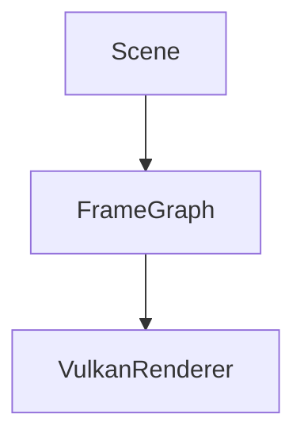

# Notes 工具链说明

这份文档解释 `notes/` 站点是怎么工作的，哪些部分是自动生成的，哪些部分仍然需要手工维护，以及如果想改成更适合自己阅读习惯的样子，应该改哪里。

## 目标

这套工具链要解决四件事：

1. 把 `notes/` 作为项目的人类可读入口。
2. 把 `docs/requirements/` 下仍在进行中的需求文档自动挂进站点。
3. 保证本地预览时，文档修改能尽快反映到页面。
4. 支持 LaTeX 数学公式和 Mermaid 图示，而不引入额外的 Python 插件安装负担。

## 相关文件

```text
scripts/serve-notes.sh
scripts/_gen_notes_site.py
scripts/_notes_hooks.py
mkdocs.yml
mkdocs.gen.yml
notes/assets/javascripts/
notes/nav.yml
notes/
docs/requirements/
notes/requirements/
```

## 整体流程

首次启动本地站点：

```bash
scripts/serve-notes.sh
```

实际流程分成两步：

1. `scripts/serve-notes.sh` 先调用 `python3 scripts/_gen_notes_site.py`
2. 然后用 `mkdocs serve -f mkdocs.gen.yml` 启动站点

也就是说，真正被 MkDocs 使用的不是手写的 `mkdocs.yml`，而是生成后的 `mkdocs.gen.yml`。`mkdocs.yml` 现在尽量保持最小，只描述站点行为，不手写导航树。

现在推荐的统一入口是：

```bash
scripts/serve-notes.sh
```

它会：

1. 重生成 `mkdocs.gen.yml`
2. 自动停止旧的 notes 服务
3. 在后台重启新的 `mkdocs serve`

## 各文件职责

### `mkdocs.yml`

这是手写的基础配置，定义：

- 站点标题
- 主题
- Markdown 扩展

这里适合放站点基础行为，例如：

- 主题
- 代码高亮
- 搜索
- 菜单是否默认展开
- MathJax 与 Mermaid 的前端加载配置

这里不再手写具体文档导航。

当前的公式与图示方案是：

- **LaTeX**：`pymdownx.arithmatex + MathJax`
- **Mermaid**：浏览器端加载 `mermaid.min.js`，由本地初始化脚本把 ` ```mermaid ` 代码块渲染成图

这么做的原因是和现有 notes 工具链最兼容：

- 不需要额外安装 `mkdocs-mermaid2-plugin`
- 不会给 `scripts/_gen_notes_site.py` 生成 `mkdocs.gen.yml` 增加插件依赖
- `serve-notes.sh` 保持轻量

### 文档里怎么写公式

行内公式：

```markdown
\( O(1) \)
```

块级公式：

```markdown
\[
\mathrm{state}_t = \mathrm{fold}(\mathrm{events}_{0..t}, \mathrm{initial})
\]
```

### 文档里怎么写 Mermaid 图

````markdown

````

运行中的站点会在页面端把这段代码渲染成图示。

### `scripts/_gen_notes_site.py`

这是生成器。它现在做五件事：

1. 扫描 `docs/requirements/*.md`
2. 在 `notes/requirements/` 下创建对应符号链接
3. 扫描 `notes/tools/*.md` 并生成 `notes/tools/index.md`
4. 读取 `notes/nav.yml` 作为站点导航唯一来源
5. 读取 `mkdocs.yml`，补出 nav、watch 和 hooks，写成 `mkdocs.gen.yml`

所以它现在解决的是两个问题：

- 活跃需求文档不想复制到 `notes/`，但又想在站点里显示
- 左侧导航需要手工决定层级、标题和顺序，而不是继续靠目录结构自动推导

### `notes/nav.yml`

这是站点导航配置文件，也是左侧菜单的唯一事实来源。

它负责定义：

- 哪些页面会进入导航
- 一级 / 二级菜单怎么组织
- 同一层里各项的显示顺序
- 菜单标题要显示成什么名字

当前采用的是**严格配置模式**：

- 只有出现在 `notes/nav.yml` 里的页面才会出现在左侧导航
- `notes/` 里新增了 `.md` 文件，如果没有把它写进 `notes/nav.yml`，站点菜单里就不会显示
- 这样可以避免“新建一个临时文档，菜单结构被自动改掉”的情况

当前站点一级菜单固定为：

- `速览`
- `GetStarted`
- `Tutorial`
- `概念`
- `设计`
- `后端实现`
- `需求（进行中）`
- `Roadmap`
- `相关工具`

其中 `设计` 菜单当前再拆成一层：

- 基础设计页：`架构总览`、`术语概念`、`项目目录结构`
- `子系统` 子分组：承载 `notes/subsystems/` 下的当前子系统设计文档

`后端实现` 当前作为独立一级菜单，先收纳 `Vulkan Backend` 这组按实现模块拆开的后端专题文档。

不过有两类目录例外，它们仍然允许通过占位符动态展开：

- `@requirements`：展开 `docs/requirements/*.md` 映射到 `notes/requirements/` 的活动需求页
- `@roadmaps`：展开 `notes/roadmaps/` 下的子目录，并递归生成 roadmap 分组导航

这两个占位符仍然要写在 `notes/nav.yml` 里，所以“它们出现在哪个一级菜单、排在什么位置”依旧由配置控制；变化的只是具体页面列表由目录内容自动跟随。

### `notes/requirements/`

这个目录不是手写内容源，而是生成器同步出来的链接视图。

好处：

- 活跃需求文档仍然只维护一份，在 `docs/requirements/`
- MkDocs 的 `docs_dir` 仍然可以保持为 `notes/`

### `scripts/_notes_hooks.py`

这是 MkDocs hook，处理两个运行期问题：

1. 修正 requirements 页面中的相对链接
2. 修正中文标题的锚点 slug 生成

原因是：

- 需求文档原本物理上在 `docs/requirements/`
- 但站点预览时，它们是通过 `notes/requirements/` 进入 MkDocs
- 这样一来，原始相对路径在页面上下文里可能不再正确

另外，默认标题 slugify 对中文不友好，hook 会替换为 `pymdownx.slugs.slugify(case="lower")`，让中文标题锚点更稳定。

### `scripts/serve-notes.sh`

这是本地入口脚本，负责：

- 检查 `mkdocs` 是否存在
- 先生成 `mkdocs.gen.yml`
- 自动停止目标端口上的旧服务
- 在后台启动新的 `mkdocs serve`

如果传 `--build`，它会只做静态构建，不启动开发服务器。

## 自动加载是怎么做的

当前推荐流程已经不依赖热加载。

文档更新后的稳定流程是：

```bash
scripts/serve-notes.sh
```

这一条命令会同时完成：

- 重新同步活跃需求链接
- 重写 `mkdocs.gen.yml`
- 重启本地站点

## 现在自动化到什么程度

目前已经自动化的部分：

- `docs/requirements/*.md` 会自动同步到 `notes/requirements/`
- `notes/tools/*.md` 会自动生成 `notes/tools/index.md`
- requirements 页面的相对链接与中文锚点会被 hook 修正
- `mkdocs.gen.yml` 会自动从基础配置 + 导航配置拼出来

目前仍然是手工维护的部分：

- `notes/nav.yml` 中的站点结构、标题和排序
- 新页面接入导航时的分组决策
- `@requirements` 之外的新页面，仍需要手工写进导航；`@roadmaps` 会自动按子目录递归展开

这套方案比目录扫描更偏显式配置：菜单结构稳定、可控，但新增页面时必须顺手更新导航文件。

## 如果想继续自动化

后续可以考虑两种方向：

### 现在的生成原则

- `mkdocs.yml` 只保留站点基础行为，不手写 nav
- `notes/nav.yml` 明确写出菜单树和排序
- `scripts/_gen_notes_site.py` 会校验 `notes/nav.yml` 中引用的页面是否真实存在
- `@requirements` 会在生成期展开；`@roadmaps` 会按子目录递归展开，避免 roadmap 目录整理时频繁手改导航
- `docs/requirements/` 和 `notes/tools/` 仍保留自动同步 / 自动索引
- `requirements/` 在导航里和普通 `notes/` 子目录一样出现，只是内容来源仍然是 `docs/requirements/`

## 个性化配置例子

下面这些调整，不需要改 MkDocs 本身，只要改 `scripts/_gen_notes_site.py` 或 `mkdocs.yml`。

### 例子一：调整一级菜单顺序

如果你想把 `Roadmap` 提前到 `概念` 前面，不需要改 Python，只要改 `notes/nav.yml` 里条目的顺序。

### 例子二：新增一个固定页面

如果你新增了一个稳定页面，例如 `notes/concepts/animation-object.md`，除了创建文档本身，还需要把它写进 `notes/nav.yml` 对应分组。

### 例子三：动态分组保持自动展开

如果某类页面会持续增删，例如活动需求或 roadmap，就继续在 `notes/nav.yml` 里保留 `@requirements` 或 `@roadmaps`，不要逐篇手写。对于 roadmap，新增内容应优先进入某个子目录。

当前菜单默认折叠，是因为 `mkdocs.yml` 没启用 `navigation.expand`，同时也没有启用会把顶层分组直接展开显示的 `navigation.sections`。

如果以后你想恢复全部展开，把这个特性加回去：

```yaml
theme:
  features:
    - navigation.expand
```

### 例子四：只构建不启动服务

适合 CI 或想先看生成结果时使用：

```bash
scripts/serve-notes.sh --build
```

它会输出 `.site/`，但不会启动本地服务器。

### 例子五：后台重启本地 notes 站点

```bash
scripts/serve-notes.sh
```

输出里会给你：

- 访问地址
- 新进程 PID
- 日志文件路径

## 维护建议

新增文档时可以按下面判断：

1. 如果是项目摘要、架构说明、教程、工具说明，写到 `notes/`
2. 如果是正在推进的需求，写到 `docs/requirements/`
3. 如果是行为规范或能力边界，写到 `openspec/specs/`
4. 如果是当前子系统设计说明，写到 `notes/subsystems/`

## 常用命令

本地预览：

```bash
scripts/serve-notes.sh
```

只生成站点：

```bash
scripts/serve-notes.sh --build
```

只重建动态配置：

```bash
python3 scripts/_gen_notes_site.py
```

## 一句话总结

这套文档工具链的核心原则是：

- `notes/` 负责人类阅读体验
- `mkdocs.yml` 负责站点基础行为
- `_gen_notes_site.py` 负责读取 `notes/nav.yml` 生成导航，并把活跃需求接成和 `notes/` 子目录一致的视图
- `_notes_hooks.py` 负责修正站点运行期的路径和锚点问题
