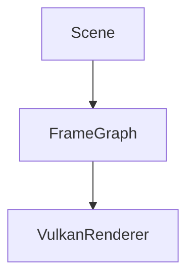

# Notes 工具链说明

解释 `notes/` 站点怎么工作：哪些自动生成、哪些手工维护，以及想改成更适合自己阅读习惯时改哪里。

## 目标

这套工具链解决三件事：

1. 把 `notes/` 作为项目唯一人类可读入口（已并入原 `docs/` 内容）
2. 保证本地预览时改动能尽快反映到页面
3. 支持 LaTeX 公式 + Mermaid 图示，不引入额外 Python 插件安装负担

## 相关文件

```text
scripts/notes/serve_site.sh
scripts/notes/generate_site_config.py
scripts/notes/mkdocs_hooks.py
mkdocs.yml
mkdocs.gen.yml
notes/assets/javascripts/
notes/nav.yml
notes/
notes/requirements/
```

## 整体流程

```bash
scripts/notes/serve_site.sh
```

分两步：

1. `scripts/notes/serve_site.sh` 调用 `python3 scripts/notes/generate_site_config.py`
2. `mkdocs serve -f mkdocs.gen.yml` 启动站点

真正被 MkDocs 使用的是 `mkdocs.gen.yml`（生成产物），不是手写 `mkdocs.yml`。后者保持最小，只描述站点基础行为。

`serve_site.sh` 会：

1. 重生成 `mkdocs.gen.yml`
2. 停止旧 notes 服务
3. 后台重启新的 `mkdocs serve`

## 各文件职责

### `mkdocs.yml`

手写基础配置：

- 站点标题 / 主题 / Markdown 扩展 / 搜索 / 代码高亮 / MathJax + Mermaid 前端加载

不再手写具体文档导航。

公式方案：`pymdownx.arithmatex + MathJax`
Mermaid 方案：浏览器端 `mermaid.min.js` 把 ` ```mermaid ` 代码块渲染成图

这么做的原因是和现有 notes 工具链最兼容：

- 不需要额外安装 `mkdocs-mermaid2-plugin`
- `generate_site_config.py` 生成 `mkdocs.gen.yml` 不引入插件依赖
- `serve_site.sh` 保持轻量

### 文档里怎么写公式

行内：

```markdown
\( O(1) \)
```

块级：

```markdown
\[
\mathrm{state}_t = \mathrm{fold}(\mathrm{events}_{0..t}, \mathrm{initial})
\]
```

### 文档里怎么写 Mermaid 图

````markdown

````

### `scripts/notes/generate_site_config.py`

生成器，做四件事：

1. 扫描 `notes/requirements/*.md`（不含 `index.md`、`README.md` 和 `finished/`）作为活跃需求列表；文件名编号按实施顺序排序
2. 扫描 `notes/tools/*.md` 并生成 `tools/index.md`
3. 读 `notes/nav.yml` 作为站点导航唯一来源
4. 读 `mkdocs.yml`，补上 nav / watch / hooks 写出 `mkdocs.gen.yml`

当前实现直接扫描 `notes/requirements/*.md`；不再依赖旧的 `docs/requirements/` 或符号链接同步逻辑。活跃需求的编号应当就是实施队列，一个 REQ 文件只覆盖一个连续实施周期；若新需求让旧需求的一部分后置，应先通过 `/draft-req` 拆分旧需求，并优先用 `NNN-a` / `NNN-b` 后缀族吸收局部插入，避免后续编号连锁变化。

### `notes/nav.yml`

左侧菜单唯一事实来源：

- 哪些页面进入导航
- 一级 / 二级菜单如何组织
- 每层内排序
- 菜单标题显示名

**严格配置模式**：只有出现在 `notes/nav.yml` 里的页面才在左侧菜单显示。新增 `.md` 若不写进 `nav.yml`，菜单不出现。

当前一级菜单固定为：

- `速览`
- `GetStarted`
- `Tutorial`
- `概念`
- `设计`
- `后端实现`
- `需求（进行中）`
- `Roadmap`
- `相关工具`

三类目录仍允许通过占位符动态展开：

- `@requirements`：展开 `notes/requirements/*.md`
- `@roadmaps`：递归展开 `notes/roadmaps/` 子目录
- `@source_analysis`：展开 `scripts/source_analysis/extract_sections.py` 里注册的分析目标

占位符写在 `nav.yml` 里，位置由配置控制；具体页面由目录内容跟随。

### `notes/requirements/`

唯一事实来源。

目录内容：

- `index.md` — 需求索引
- `NNN-*.md` — 当前活跃需求，按编号顺序实施；局部拆分用 `NNN-a-*.md`
- `finished/` — 历史归档

维护约定：

- `REQ 文件号 = 实施顺序`，用户应能从小到大直接推进
- `一个 REQ 文件 = 一个连续实施周期`
- 如果新需求插入后导致旧需求的一部分要后置，先拆旧需求，再优先使用 `NNN-a` / `NNN-b` 后缀族

### `scripts/notes/mkdocs_hooks.py`

MkDocs hook，处理运行期：

1. 修正 requirements 页面中的相对链接（历史上源目录与挂载目录不同；现在已并入 `notes/` 单根，hook 仍兼容旧情形）
2. 修正中文标题的锚点 slug 生成（替换为 `pymdownx.slugs.slugify(case="lower")`）

### `scripts/notes/serve_site.sh`

本地入口脚本：

- 检查 `mkdocs` 是否存在
- 生成 `mkdocs.gen.yml`
- 停旧服务
- 后台启动新的 `mkdocs serve`

传 `--build` 时只做静态构建，不起开发服务器。

## 自动加载

推荐流程不依赖 mkdocs 热加载：

```bash
scripts/notes/serve_site.sh
```

一条命令同时完成：重写 `mkdocs.gen.yml` / 重启本地站点。

## 自动化程度

已自动：

- `notes/tools/*.md` 自动生成 `notes/tools/index.md`
- requirements 页面相对链接与中文锚点由 hook 修正
- `mkdocs.gen.yml` 自动从基础配置 + 导航配置拼出

手工：

- `notes/nav.yml` 中的站点结构、标题、排序
- 新页面接入导航的分组决策
- `@requirements` / `@roadmaps` / `@source_analysis` 之外的新页面仍需写进导航

## 维护建议

新增文档判断：

1. 项目摘要 / 架构 / 教程 / 工具说明 → `notes/`
2. 正在推进的需求 → `notes/requirements/`
3. 行为规范 / 能力边界 → `openspec/specs/`
4. 当前子系统设计说明 → `notes/subsystems/`
5. 早期设计草稿 / 历史参考 → `notes/design/`
6. 代码评审记录 → `notes/review/`

## 常用命令

本地预览：

```bash
scripts/notes/serve_site.sh
```

只构建：

```bash
scripts/notes/serve_site.sh --build
```

只重建动态配置：

```bash
python3 scripts/notes/generate_site_config.py
```

## 一句话总结

- `notes/` 唯一人类可读入口
- `mkdocs.yml` 站点基础行为
- `generate_site_config.py` 读 `notes/nav.yml` 生成导航
- `mkdocs_hooks.py` 修正运行期路径与中文锚点
