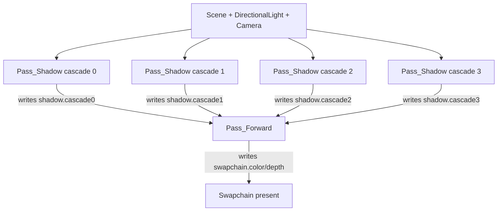

# Shadow pass 怎样写资源：先做深度底片

Shadow map 像先拍一张从灯光方向看到的深度底片。底片里不需要颜色，只需要知道哪些表面离灯更近。Forward pass 再拿这张底片判断当前像素是否被挡住。

## 当前 FrameGraph 如何排 pass

v0.1.1 的 `VulkanRenderer::initScene()` 会为主 directional light 建立四个 shadow cascade pass，然后再建立 forward pass。FrameGraph v1 记录 pass 顺序、target、read/write 声明，并在 compile 阶段检查读写关系。

## Shadow pass 只需要 depth

`assets/materials/blinnphong_lit.material` 的 `Shadow` pass 使用 `shadow_depth_only` shader。这个 pass 的任务是把 caster 的几何写进 offscreen depth attachment，不写颜色。

| 元素 | 当前职责 |
|---|---|
| `Pass_Shadow` | 每个 cascade 写一个 depth attachment |
| `shadow_depth_only.vert` | 使用 model matrix 和 `LightUBO.shadowViewProj` 变换顶点 |
| `shadow_depth_only.frag` | depth-only pass 不需要颜色输出 |
| `FrameGraphWrite` | 记录 `shadow.cascade*` 是被当前 pass 写出的资源 |

## 为什么先写后读

如果 forward pass 先执行，它还没有任何 shadow depth 可以采样。当前 FrameGraph 不做自动重排，renderer 按创建 pass 的顺序执行；因此 shadow pass 必须先进入 graph，forward pass 再声明读取这些资源。

## 我们已经学会了什么

我们知道 shadow map 在当前引擎里不是材质贴图文件，而是 FrameGraph pass 写出的临时 depth resource。它的生命期属于一帧，由 backend 为当前 frame 分配 attachment。

## 下一步

进入 [03 Forward pass 怎样读 CSM](03-csm-reading-path.md)。
